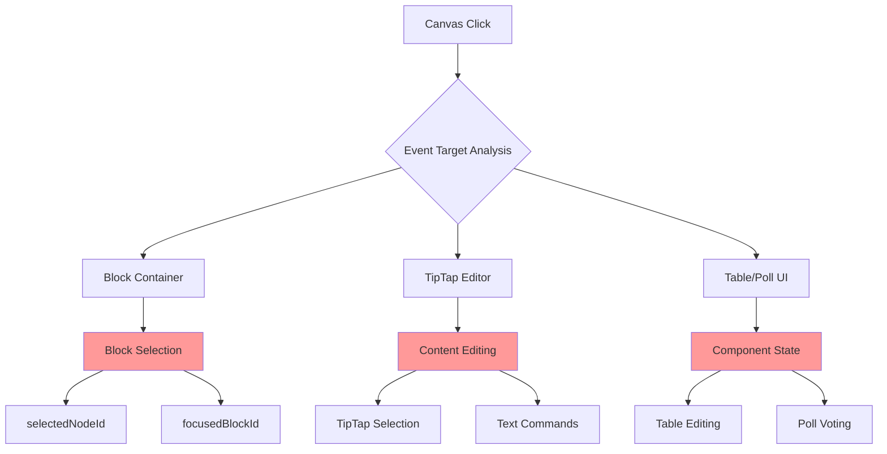

# EVIDENS Rich Block Selection System - Technical Redesign Specification

## 🎯 Executive Summary

This document provides a comprehensive technical specification for redesigning the EVIDENS Rich Block selection system to resolve critical interaction conflicts between block-level selection and content editing within TipTap-powered rich content blocks (Tables and Polls).

**Core Issues Addressed:**

- Table/Poll text content cannot be clicked for editing due to event interference
- Multiple uncoordinated selection states causing UI confusion
- Non-exclusive selection behaviors between block and content layers
- Microscopic clickable areas for block selection
- Block selection not maintained during content editing sessions

## 📋 Table of Contents

1. [Current State Analysis](#current-state-analysis)
2. [Architecture & Integration Analysis](#architecture--integration-analysis)
3. [Technical Architecture Requirements](#technical-architecture-requirements)
4. [Implementation Specifications](#implementation-specifications)
5. [User Experience Goals](#user-experience-goals)
6. [Testing & Verification](#testing--verification)
7. [Migration Strategy](#migration-strategy)

---

## 1. Current State Analysis

### 1.1 File Structure & Selection Components

**Primary Selection-Related Files:**

- `/src/store/editorStore.ts` (Lines 189-190, 455-463) - Legacy editor selection state
- `/src/store/unifiedEditorStore.ts` (Lines 142-155, 262-325) - Unified selection system
- `/src/components/unified-editor/RichContentBlock.tsx` (Lines 118-295) - Block-level interaction
- `/src/components/unified-editor/UnifiedTipTapEditor.tsx` (Lines 212-259) - Content-level interaction
- `/src/components/editor/extensions/Table/TableComponent.tsx` (Lines 552-686) - Table interaction
- `/src/components/editor/extensions/Poll/PollComponent.tsx` (Lines 620-840) - Poll interaction

### 1.2 Current Selection State Schema

**editorStore.ts Selection State:**

```typescript
// Legacy system (lines 189-190)
selectedNodeId: null,
textSelection: null, // Text selection for unified typography editing

// Selection actions (lines 457-463)
selectNode: nodeId => set({ selectedNodeId: nodeId }),
setTextSelection: textSelection => set({ textSelection }),
```

**unifiedEditorStore.ts Selection State:**

```typescript
// Unified system (lines 142-155)
selection: {
  primary: null,           // Primary selected block
  secondary: [],           // Additional selected blocks
  selectionRect: null,     // Multi-selection bounding box
  lastSelected: null,      // For shift-click selection
},
interaction: {
  focusedBlockId: null,
  activeEditor: {
    blockId: null,
    selection: null,       // TipTap selection range
    contextualFeatures: [],
  },
},
```

### 1.3 Event Handling Patterns

**Block-Level Events (RichContentBlock.tsx):**

```typescript
// Lines 118-151: handleMouseDown
const handleMouseDown = useCallback((event: React.MouseEvent) => {
  const zone = classifyInteractionZone(event);

  if (zone === InteractionZone.SAFE_ZONE) {
    // Let TipTap handle the event
    return; // ❌ ISSUE: No block selection possible in safe zone
  }

  event.preventDefault();
  event.stopPropagation(); // ❌ ISSUE: Blocks all child event propagation

  // Select the block
  actions.selectBlock(block.id, { multiSelect, rangeSelect });
}, []);

// Lines 278-295: handleDoubleClick
const handleDoubleClick = useCallback((event: React.MouseEvent) => {
  const zone = classifyInteractionZone(event);
  if (zone !== InteractionZone.SAFE_ZONE) {
    actions.focusBlock(block.id);
    // Focus the TipTap editor
    const editorElement = blockRef.current?.querySelector('.ProseMirror');
    if (editorElement) {
      editorElement.focus(); // ❌ ISSUE: Forces focus, breaking user intent
    }
  }
}, []);
```

**TipTap Editor Events (UnifiedTipTapEditor.tsx):**

```typescript
// Lines 212-259: handleKeyDown
handleKeyDown(view, event) {
  // Handle editor-specific shortcuts
  if (event.key === 'Delete' || event.key === 'Backspace') {
    if (!selection.empty || state.doc.textContent.length > 0) {
      event.stopPropagation(); // ❌ ISSUE: Prevents block deletion
    }
  }

  if (event.key === 'Escape') {
    view.dom.blur();
    event.preventDefault();
    event.stopPropagation(); // ❌ ISSUE: Doesn't coordinate with block selection
    return true;
  }
  return false;
},
```

**Table Component Events (TableComponent.tsx):**

```typescript
// Lines 624-627: Cell click handling
onClick={() => setActiveCell({ row: rowIndex, col: colIndex })}
onDoubleClick={() => startEditing(rowIndex, colIndex)}

// Lines 664-668: Option click in polls
onClick={e => {
  if (!showResults && !editingOption && selected) {
    handleVote(option.id); // ❌ ISSUE: Voting conflicts with text editing
  }
}}
```

### 1.4 TipTap Integration Points & Conflicts

**SafeZone Classification Logic (RichContentBlock.tsx lines 48-112):**

```typescript
const classifyInteractionZone = useCallback((event: React.MouseEvent): InteractionZone => {
  // Check if in editor content area (safe zone)
  const editorElement = blockRef.current.querySelector('.ProseMirror');
  if (editorElement) {
    const editorRect = editorElement.getBoundingClientRect();
    const safeZone = {
      left: editorRect.left + SAFE_ZONE_PADDING,   // ❌ ISSUE: Too restrictive
      right: editorRect.right - SAFE_ZONE_PADDING,
      top: editorRect.top + SAFE_ZONE_PADDING,
      bottom: editorRect.bottom - SAFE_ZONE_PADDING,
    };

    const isInSafeZone = /* coordinate checks */;
    if (isInSafeZone) {
      return InteractionZone.SAFE_ZONE; // ❌ ISSUE: Most of table/poll becomes safe zone
    }
  }
  return InteractionZone.SELECTION_AREA;
}, []);
```

**Configuration Issues:**

```typescript
// Safe zone constants (too restrictive for complex content)
const DEFAULT_SAFE_ZONE_CONFIG: SafeZoneConfig = {
  HANDLE_WIDTH: 8, // ❌ Too narrow for easy selection
  RESIZE_CORNER_SIZE: 12, // ❌ Too small for precise interaction
  SAFE_ZONE_PADDING: 4, // ❌ Makes entire content area unsafe for block selection
  // ...
};
```

### 1.5 Component-Level Selection Issues

**Table Component Selection Problems:**

1. **Conflicting click handlers:** Cell selection vs block selection vs text editing
2. **Event propagation:** Table events stop propagation, blocking block selection
3. **Focus management:** Table focus competes with block focus
4. **Edit mode conflicts:** Table edit mode vs TipTap focus mode

**Poll Component Selection Problems:**

1. **Voting vs editing:** Vote clicks interfere with text editing in options
2. **Question editing:** No clear distinction between block selection and content editing
3. **Option management:** Add/remove buttons conflict with text selection

---

## 2. Architecture & Integration Analysis

### 2.1 Current System Architecture



**Current Problems:**

- **Three separate selection systems** operating independently
- **No coordination mechanism** between selection layers
- **Event interference** at multiple levels
- **State synchronization issues** between stores

### 2.2 TipTap Editor Integration Points

**Extension Integration:**

- **TableExtension** (`/src/components/editor/extensions/Table/`)
- **PollExtension** (`/src/components/editor/extensions/Poll/`)
- **NodeView Components** (TableComponent.tsx, PollComponent.tsx)

**Current Integration Issues:**

1. **NodeView event handling** conflicts with editor selection
2. **Component registration** doesn't coordinate with block selection
3. **Command execution** bypasses block selection state
4. **Focus management** between editor and components is uncoordinated

---

## 3. Technical Architecture Requirements

### 3.1 Unified Event Flow Architecture

**Required Event Hierarchy:**

```typescript
interface EventFlowSpec {
  1: 'Canvas Level'; // Viewport, zoom, global shortcuts
  2: 'Block Level'; // Block selection, drag, resize
  3: 'Content Level'; // TipTap editor content
  4: 'Component Level'; // Table cells, poll options
}
```

**Event Coordination Requirements:**

- **Single source of truth** for selection state
- **Hierarchical event handling** with clear delegation rules
- **Coordinated focus management** between all layers
- **Unified keyboard shortcut system**

### 3.2 Selection State Schema

**Required Unified Selection State:**

```typescript
interface UnifiedSelectionState {
  // Block-level selection
  selectedBlocks: {
    primary: string | null;
    secondary: string[];
    multiSelectActive: boolean;
    selectionRect: DOMRect | null;
  };

  // Content-level focus and editing
  contentFocus: {
    activeBlockId: string | null;
    editorMode: 'block' | 'content' | 'component';
    tiptapSelection: any | null;
    componentState: {
      tableActiveCell: CellPosition | null;
      pollEditingOption: string | null;
      pollEditingQuestion: boolean;
    };
  };

  // Interaction mode tracking
  interaction: {
    mode: 'selecting' | 'editing' | 'dragging' | 'resizing';
    lastInteractionZone: InteractionZone;
    keyboardMode: 'block' | 'content';
  };
}
```

### 3.3 Safe Zone Redesign

**New Safe Zone Logic:**

```typescript
interface EnhancedSafeZoneConfig {
  // Zone definitions
  zones: {
    BLOCK_SELECTION: number; // Outer border for block selection
    CONTENT_EDITING: number; // Inner area for content editing
    COMPONENT_UI: number; // Specific UI elements (buttons, etc.)
  };

  // Interaction rules
  rules: {
    allowBlockSelectionInContent: boolean; // NEW: Allow block selection via special clicks
    contentClickFocusesBlock: boolean; // NEW: Content clicks focus block
    maintainBlockSelectionDuringEdit: boolean; // NEW: Keep block selected while editing
  };

  // Context-aware zones
  contextualZones: {
    table: TableSafeZoneConfig;
    poll: PollSafeZoneConfig;
    richText: RichTextSafeZoneConfig;
  };
}
```

### 3.4 Event Delegation Architecture

**Required Event Delegation System:**

```typescript
interface EventDelegationSpec {
  // Primary event router
  EventRouter: {
    analyzeEventTarget(event: Event): EventContext;
    determineHandler(context: EventContext): HandlerType;
    executeHandler(handler: HandlerType, event: Event): void;
  };

  // Event context analysis
  EventContext: {
    targetType: 'canvas' | 'block' | 'content' | 'component';
    interactionZone: InteractionZone;
    currentSelection: SelectionState;
    modifierKeys: ModifierKeyState;
  };

  // Handler coordination
  HandlerCoordination: {
    beforeHandler: () => void;
    executeHandler: () => void;
    afterHandler: () => void;
    syncState: () => void;
  };
}
```

---

## 4. Implementation Specifications

### 4.1 Core Architecture Changes

#### 4.1.1 Event Router Implementation

**File:** `/src/components/unified-editor/EventRouter.ts`

```typescript
export class UnifiedEventRouter {
  private store: EditorStore;

  constructor(store: EditorStore) {
    this.store = store;
  }

  public handleMouseEvent(event: MouseEvent): EventHandlerResult {
    const context = this.analyzeEventContext(event);
    const handler = this.selectHandler(context);

    return this.executeHandler(handler, event, context);
  }

  private analyzeEventContext(event: MouseEvent): EventContext {
    const target = event.target as HTMLElement;
    const blockElement = target.closest('[data-block-id]');
    const editorElement = target.closest('.ProseMirror');
    const componentElement = target.closest('.table-component, .poll-component');

    return {
      targetType: this.determineTargetType(target, blockElement, editorElement, componentElement),
      blockId: blockElement?.getAttribute('data-block-id') || null,
      interactionZone: this.classifyInteractionZone(event, blockElement),
      componentType: this.getComponentType(componentElement),
      modifiers: {
        ctrl: event.ctrlKey,
        shift: event.shiftKey,
        meta: event.metaKey,
        alt: event.altKey,
      },
    };
  }

  private selectHandler(context: EventContext): EventHandler {
    // Hierarchical handler selection based on context
    if (context.targetType === 'component' && context.interactionZone === 'ui-element') {
      return new ComponentUIHandler();
    }

    if (context.targetType === 'content' && context.interactionZone === 'safe-zone') {
      return new ContentEditingHandler();
    }

    if (context.targetType === 'block') {
      return new BlockSelectionHandler();
    }

    return new CanvasHandler();
  }
}
```

#### 4.1.2 Enhanced Safe Zone System

**File:** `/src/components/unified-editor/SafeZoneSystem.ts`

```typescript
export class EnhancedSafeZoneSystem {
  private config: EnhancedSafeZoneConfig;

  public classifyInteractionZone(
    event: MouseEvent,
    blockElement: HTMLElement,
    contentType: 'richText' | 'table' | 'poll'
  ): InteractionZone {
    const rect = blockElement.getBoundingClientRect();
    const { clientX, clientY } = event;

    // Context-aware zone classification
    switch (contentType) {
      case 'table':
        return this.classifyTableZone(event, blockElement);
      case 'poll':
        return this.classifyPollZone(event, blockElement);
      default:
        return this.classifyRichTextZone(event, blockElement);
    }
  }

  private classifyTableZone(event: MouseEvent, blockElement: HTMLElement): InteractionZone {
    const target = event.target as HTMLElement;

    // Table-specific zone logic
    if (target.matches('input[type="text"], textarea')) {
      return InteractionZone.CONTENT_EDITING;
    }

    if (target.closest('.table-cell-content')) {
      // Special handling: Ctrl+click in content allows block selection
      if (event.ctrlKey || event.metaKey) {
        return InteractionZone.BLOCK_SELECTION;
      }
      return InteractionZone.CONTENT_EDITING;
    }

    if (target.closest('.table-ui-controls')) {
      return InteractionZone.COMPONENT_UI;
    }

    return this.classifyGenericZone(event, blockElement);
  }

  private classifyPollZone(event: MouseEvent, blockElement: HTMLElement): InteractionZone {
    const target = event.target as HTMLElement;

    // Poll-specific zone logic
    if (target.matches('input[type="text"], textarea')) {
      return InteractionZone.CONTENT_EDITING;
    }

    if (target.closest('.poll-option-text')) {
      // Double-click for editing, single click for voting
      if (event.detail === 2) {
        // Double click
        return InteractionZone.CONTENT_EDITING;
      }
      return InteractionZone.COMPONENT_UI; // Voting
    }

    if (target.closest('.poll-question')) {
      if (event.detail === 2) {
        // Double click
        return InteractionZone.CONTENT_EDITING;
      }
      // Ctrl+click allows block selection even in question area
      if (event.ctrlKey || event.metaKey) {
        return InteractionZone.BLOCK_SELECTION;
      }
      return InteractionZone.CONTENT_READING;
    }

    return this.classifyGenericZone(event, blockElement);
  }
}
```

#### 4.1.3 Unified Selection Manager

**File:** `/src/components/unified-editor/SelectionManager.ts`

```typescript
export class UnifiedSelectionManager {
  private store: EditorStore;
  private eventRouter: UnifiedEventRouter;

  public selectBlock(
    blockId: string,
    options: {
      multiSelect?: boolean;
      rangeSelect?: boolean;
      maintainContentFocus?: boolean;
    } = {}
  ): void {
    // Update block selection
    this.updateBlockSelection(blockId, options);

    // Coordinate with content focus
    if (!options.maintainContentFocus) {
      this.updateContentFocus(blockId, 'block');
    }

    // Update UI indicators
    this.updateSelectionUI();

    // Emit selection events
    this.emitSelectionEvent('block-selected', { blockId, options });
  }

  public focusContent(
    blockId: string,
    contentType: 'richText' | 'table' | 'poll',
    specificTarget?: any
  ): void {
    // Ensure block is selected
    if (!this.isBlockSelected(blockId)) {
      this.selectBlock(blockId, { maintainContentFocus: true });
    }

    // Focus appropriate content
    switch (contentType) {
      case 'table':
        this.focusTableContent(blockId, specificTarget);
        break;
      case 'poll':
        this.focusPollContent(blockId, specificTarget);
        break;
      default:
        this.focusRichTextContent(blockId);
    }

    // Update interaction mode
    this.store.actions.setInteractionMode('editing');
    this.emitSelectionEvent('content-focused', { blockId, contentType });
  }

  private focusTableContent(blockId: string, cellPosition?: CellPosition): void {
    const tableComponent = this.getTableComponent(blockId);
    if (tableComponent && cellPosition) {
      tableComponent.setActiveCell(cellPosition);
      // Focus without losing block selection
      this.store.actions.updateContentFocus({
        activeBlockId: blockId,
        editorMode: 'component',
        componentState: {
          tableActiveCell: cellPosition,
          pollEditingOption: null,
          pollEditingQuestion: false,
        },
      });
    }
  }
}
```

### 4.2 Component-Specific Implementations

#### 4.2.1 Enhanced RichContentBlock

**File:** `/src/components/unified-editor/RichContentBlock.tsx` (Lines 118-295 replacement)

```typescript
const RichContentBlock: React.FC<RichContentBlockProps> = ({ block, isPreview }) => {
  const selectionManager = useSelectionManager();
  const eventRouter = useEventRouter();

  // Enhanced event handling
  const handleMouseEvent = useCallback((event: React.MouseEvent) => {
    if (isPreview) return;

    const result = eventRouter.handleMouseEvent(event.nativeEvent);

    // Apply result based on event router decision
    switch (result.action) {
      case 'select-block':
        selectionManager.selectBlock(block.id, result.options);
        break;
      case 'focus-content':
        selectionManager.focusContent(block.id, result.contentType, result.target);
        break;
      case 'delegate-to-component':
        // Let component handle the event
        break;
      default:
        // Default block selection behavior
        selectionManager.selectBlock(block.id);
    }
  }, [block.id, selectionManager, eventRouter, isPreview]);

  // Coordinated keyboard handling
  const handleKeyDown = useCallback((event: React.KeyboardEvent) => {
    if (!isSelected) return;

    const result = eventRouter.handleKeyboardEvent(event.nativeEvent);

    if (result.handled) {
      event.preventDefault();
      event.stopPropagation();
    }
  }, [isSelected, eventRouter]);

  return (
    <div
      ref={blockRef}
      className={cn(/* ... */)}
      onMouseDown={handleMouseEvent}
      onDoubleClick={handleMouseEvent}
      onClick={handleMouseEvent}
      onKeyDown={handleKeyDown}
      data-block-id={block.id}
    >
      {/* Selection indicators with enhanced visibility */}
      {isSelected && (
        <>
          <div className="absolute inset-0 border-2 rounded pointer-events-none -m-px border-primary" />
          {/* Enhanced selection handles */}
          <div className="absolute -top-2 -left-2 w-4 h-4 bg-primary border border-white rounded cursor-nw-resize" />
          {/* ... other handles ... */}
        </>
      )}

      {/* Content with coordinated focus */}
      <UnifiedTipTapEditor
        blockId={block.id}
        content={block.content.tiptapJSON}
        onContentChange={content => actions.updateContent(block.id, content)}
        onFocusRequest={() => selectionManager.focusContent(block.id, 'richText')}
        selectionManager={selectionManager}
      />
    </div>
  );
};
```

#### 4.2.2 Enhanced Table Component Integration

**File:** `/src/components/editor/extensions/Table/TableComponent.tsx` (Lines 552-686 replacement)

```typescript
const TableComponentInner: React.FC<TableComponentProps> = ({ node, updateAttributes, selected }) => {
  const selectionManager = useSelectionManager();
  const [localState, setLocalState] = useState(/* ... */);

  // Coordinated cell interaction
  const handleCellClick = useCallback((row: number, col: number, event: React.MouseEvent) => {
    const zone = selectionManager.classifyInteractionZone(event.nativeEvent, 'table');

    switch (zone) {
      case InteractionZone.CONTENT_EDITING:
        // Focus cell for editing while maintaining block selection
        selectionManager.focusContent(node.attrs.blockId, 'table', { row, col });
        setActiveCell({ row, col });
        break;

      case InteractionZone.BLOCK_SELECTION:
        // Ctrl+click: Select block without losing current cell focus
        if (event.ctrlKey || event.metaKey) {
          selectionManager.selectBlock(node.attrs.blockId, { maintainContentFocus: true });
        }
        break;

      case InteractionZone.COMPONENT_UI:
        // Regular cell selection for navigation
        setActiveCell({ row, col });
        break;
    }
  }, [selectionManager, node.attrs.blockId]);

  const handleCellDoubleClick = useCallback((row: number, col: number) => {
    // Always enter editing mode on double-click
    selectionManager.focusContent(node.attrs.blockId, 'table', { row, col });
    startEditing(row, col);
  }, [selectionManager, node.attrs.blockId]);

  return (
    <NodeViewWrapper className="table-wrapper">
      <div className={cn(/* enhanced selection styling */)}>
        {/* Table content with coordinated event handling */}
        <table>
          <tbody>
            {tableData.rows.map((row, rowIndex) => (
              <tr key={`row-${rowIndex}`}>
                {row.map((cell, colIndex) => (
                  <td
                    key={`cell-${rowIndex}-${colIndex}`}
                    className={cn(
                      'table-cell-content', // Enhanced class for zone detection
                      isActiveCellPosition(rowIndex, colIndex) && 'cell-active'
                    )}
                    onClick={e => handleCellClick(rowIndex, colIndex, e)}
                    onDoubleClick={() => handleCellDoubleClick(rowIndex, colIndex)}
                  >
                    {isEditingCellPosition(rowIndex, colIndex) ? (
                      <Input
                        value={editValue}
                        onChange={e => setEditValue(e.target.value)}
                        onBlur={finishEditing}
                        className="cell-input" // Enhanced class for zone detection
                        autoFocus
                      />
                    ) : (
                      <span className="cell-display">{cell || ''}</span>
                    )}
                  </td>
                ))}
              </tr>
            ))}
          </tbody>
        </table>
      </div>
    </NodeViewWrapper>
  );
};
```

#### 4.2.3 Enhanced Poll Component Integration

**File:** `/src/components/editor/extensions/Poll/PollComponent.tsx` (Lines 620-840 replacement)

```typescript
const PollComponentInner: React.FC<PollComponentProps> = ({ node, updateAttributes, selected }) => {
  const selectionManager = useSelectionManager();

  // Coordinated question editing
  const handleQuestionClick = useCallback((event: React.MouseEvent) => {
    const zone = selectionManager.classifyInteractionZone(event.nativeEvent, 'poll');

    if (event.detail === 2) { // Double-click
      selectionManager.focusContent(node.attrs.blockId, 'poll', { target: 'question' });
      startEditingQuestion();
    } else if (event.ctrlKey || event.metaKey) {
      // Ctrl+click: Select block
      selectionManager.selectBlock(node.attrs.blockId, { maintainContentFocus: true });
    }
  }, [selectionManager, node.attrs.blockId]);

  // Coordinated option interaction
  const handleOptionClick = useCallback((optionId: string, event: React.MouseEvent) => {
    const zone = selectionManager.classifyInteractionZone(event.nativeEvent, 'poll');

    if (event.detail === 2) { // Double-click to edit
      selectionManager.focusContent(node.attrs.blockId, 'poll', { target: 'option', optionId });
      startEditingOption(optionId);
    } else if (selected && !editingOption) {
      // Single click to vote (only when block is selected and not editing)
      handleVote(optionId);
    }
  }, [selectionManager, node.attrs.blockId, selected, editingOption]);

  return (
    <NodeViewWrapper className="poll-wrapper">
      <div className={cn(/* enhanced selection styling */)}>
        {/* Question with coordinated interaction */}
        <div
          className="poll-question" // Enhanced class for zone detection
          onClick={handleQuestionClick}
        >
          {editingQuestion ? (
            <Textarea
              value={questionText}
              onChange={e => setQuestionText(e.target.value)}
              className="question-input" // Enhanced class for zone detection
            />
          ) : (
            <span>{pollData.question}</span>
          )}
        </div>

        {/* Options with coordinated interaction */}
        {pollData.options.map(option => (
          <div
            key={option.id}
            className="poll-option" // Enhanced class for zone detection
            onClick={e => handleOptionClick(option.id, e)}
          >
            <div className="poll-option-text"> {/* Enhanced class for zone detection */}
              {editingOption === option.id ? (
                <Input
                  value={optionText}
                  onChange={e => setOptionText(e.target.value)}
                  className="option-input" // Enhanced class for zone detection
                />
              ) : (
                <span>{option.text}</span>
              )}
            </div>
          </div>
        ))}
      </div>
    </NodeViewWrapper>
  );
};
```

### 4.3 State Management Updates

#### 4.3.1 Enhanced Store Integration

**File:** `/src/store/unifiedEditorStore.ts` (Lines 142-325 replacement)

```typescript
// Enhanced selection state (replaces lines 142-155)
selection: {
  primary: null,
  secondary: [],
  selectionRect: null,
  lastSelected: null,
  // NEW: Enhanced selection metadata
  metadata: {
    selectionTimestamp: null,
    selectionSource: null, // 'mouse' | 'keyboard' | 'programmatic'
    multiSelectActive: false,
    selectionRect: null,
  },
},

// Enhanced interaction state (replaces lines 156-169)
interaction: {
  focusedBlockId: null,
  mode: 'selecting', // 'selecting' | 'editing' | 'dragging' | 'resizing'
  activeEditor: {
    blockId: null,
    editorMode: 'block', // 'block' | 'content' | 'component'
    selection: null,
    contextualFeatures: [],
  },
  // NEW: Component-specific state
  componentState: {
    tableActiveCell: null,
    tableEditingCell: null,
    pollEditingOption: null,
    pollEditingQuestion: false,
  },
  // NEW: Keyboard interaction mode
  keyboardMode: 'block', // 'block' | 'content'
},

// Enhanced selection actions (replaces lines 262-325)
actions: {
  // Coordinated block selection
  selectBlock: (id: string, options = {}) => {
    const {
      multiSelect = false,
      rangeSelect = false,
      maintainContentFocus = false,
      source = 'mouse'
    } = options;

    set(state => {
      // Update selection with metadata
      if (!multiSelect && !rangeSelect) {
        state.selection.primary = id;
        state.selection.secondary = [];
      } else if (multiSelect) {
        if (state.selection.primary === null) {
          state.selection.primary = id;
        } else if (state.selection.primary !== id && !state.selection.secondary.includes(id)) {
          state.selection.secondary.push(id);
        }
      }

      // Update selection metadata
      state.selection.metadata = {
        selectionTimestamp: Date.now(),
        selectionSource: source,
        multiSelectActive: multiSelect,
        selectionRect: null, // Will be calculated by UI
      };

      state.selection.lastSelected = id;

      // Coordinate with content focus
      if (!maintainContentFocus) {
        state.interaction.focusedBlockId = id;
        state.interaction.mode = 'selecting';
      }
    });
  },

  // Enhanced content focus
  focusContent: (blockId: string, contentType: string, target?: any) => {
    set(state => {
      // Ensure block is selected
      if (state.selection.primary !== blockId && !state.selection.secondary.includes(blockId)) {
        state.selection.primary = blockId;
      }

      // Update interaction state
      state.interaction.focusedBlockId = blockId;
      state.interaction.mode = 'editing';
      state.interaction.activeEditor.blockId = blockId;
      state.interaction.activeEditor.editorMode = 'content';
      state.interaction.keyboardMode = 'content';

      // Update component-specific state
      if (contentType === 'table' && target) {
        state.interaction.componentState.tableActiveCell = target;
      } else if (contentType === 'poll' && target) {
        if (target.target === 'question') {
          state.interaction.componentState.pollEditingQuestion = true;
        } else if (target.target === 'option') {
          state.interaction.componentState.pollEditingOption = target.optionId;
        }
      }
    });
  },

  // Enhanced selection clearing
  clearSelection: () => {
    set(state => {
      state.selection.primary = null;
      state.selection.secondary = [];
      state.selection.selectionRect = null;
      state.selection.lastSelected = null;
      state.selection.metadata = {
        selectionTimestamp: null,
        selectionSource: null,
        multiSelectActive: false,
        selectionRect: null,
      };

      // Clear interaction state
      state.interaction.focusedBlockId = null;
      state.interaction.mode = 'selecting';
      state.interaction.activeEditor = {
        blockId: null,
        editorMode: 'block',
        selection: null,
        contextualFeatures: [],
      };
      state.interaction.componentState = {
        tableActiveCell: null,
        tableEditingCell: null,
        pollEditingOption: null,
        pollEditingQuestion: false,
      };
      state.interaction.keyboardMode = 'block';
    });
  },

  // NEW: Set interaction mode
  setInteractionMode: (mode: 'selecting' | 'editing' | 'dragging' | 'resizing') => {
    set(state => {
      state.interaction.mode = mode;
    });
  },

  // NEW: Update component state
  updateComponentState: (updates: Partial<ComponentState>) => {
    set(state => {
      Object.assign(state.interaction.componentState, updates);
    });
  },
},
```

### 4.4 Enhanced Configuration

#### 4.4.1 Updated Safe Zone Configuration

**File:** `/src/types/unified-editor.ts` (Lines 106-116 replacement)

```typescript
export interface EnhancedSafeZoneConfig {
  // Zone boundaries (pixels from block edge)
  zones: {
    BLOCK_SELECTION: number; // 12px - Outer zone for block selection
    CONTENT_INTERACTION: number; // 8px - Inner zone for content interaction
    COMPONENT_UI: number; // 4px - Specific UI elements
  };

  // Interaction behavior rules
  rules: {
    allowBlockSelectionInContent: boolean; // true - Ctrl+click in content selects block
    contentClickFocusesBlock: boolean; // true - Content clicks focus the block
    maintainBlockSelectionDuringEdit: boolean; // true - Keep block selected while editing
    doubleClickEntersEditMode: boolean; // true - Double-click always enters edit mode
    escapeExitsEditMode: boolean; // true - Escape returns to block selection
  };

  // Context-specific configurations
  contexts: {
    table: {
      cellEditingRequiresDoubleClick: boolean; // true - Single click for navigation, double for editing
      allowVotingWhileBlockSelected: boolean; // false - Require explicit focus for voting
      headerClickBehavior: 'select' | 'edit';
    };
    poll: {
      questionEditingRequiresDoubleClick: boolean; // true - Double-click to edit question
      optionClickBehavior: 'vote' | 'edit' | 'select'; // Context-dependent
      allowVotingWhileEditing: boolean; // false - No voting during edit mode
    };
    richText: {
      immediateEditMode: boolean; // true - Click immediately focuses editor
      maintainBlockSelectionOnFocus: boolean; // true - Keep block selected when editing
    };
  };

  // Enhanced cursor management
  cursors: {
    blockSelection: 'pointer';
    contentEditing: 'text';
    componentUI: 'pointer';
    dragging: 'move';
    resizing: 'nw-resize' | 'ne-resize' | 'se-resize' | 'sw-resize';
  };
}
```

---

## 5. User Experience Goals

### 5.1 Interaction Flow Requirements

**Goal 1: Intuitive Table Text Editing**

```
Current: User clicks table cell → No response (click blocked)
Required: User clicks table cell → Cell highlights → Double-click → Text editing mode
```

**Goal 2: Maintained Block Selection During Editing**

```
Current: Enter edit mode → Block selection lost → Confusing UI state
Required: Enter edit mode → Block remains visually selected → Clear editing context
```

**Goal 3: Unambiguous Poll Interaction**

```
Current: Click poll option → Unpredictable (vote vs edit vs nothing)
Required: Click option → Vote | Double-click option → Edit text | Ctrl+click → Select block
```

**Goal 4: Enhanced Block Selection Areas**

```
Current: Tiny border areas for block selection
Required: Larger hit targets + Ctrl+click anywhere for block selection
```

**Goal 5: Coordinated Keyboard Navigation**

```
Current: Keyboard shortcuts work inconsistently across contexts
Required: Context-aware shortcuts with clear mode indicators
```

### 5.2 Visual Feedback Requirements

**Enhanced Selection Indicators:**

- **Block Selection:** 2px blue border with corner handles (12px x 12px)
- **Content Focus:** Inner blue glow/ring while maintaining block selection
- **Component Active:** Highlighted cells/options with focus indicators
- **Edit Mode:** Clear visual distinction with input styling

**Cursor Behavior:**

- **Block areas:** Pointer cursor with move/resize variations
- **Content areas:** Text cursor with context indicators
- **Component UI:** Pointer cursor with action indicators

### 5.3 Accessibility Requirements

**Keyboard Navigation:**

- Tab: Navigate between blocks
- Enter: Enter edit mode for focused block
- Escape: Exit edit mode, return to block selection
- Arrow keys: Context-aware navigation (block vs content vs component)

**Screen Reader Support:**

- Clear aria-labels for interaction zones
- State announcements for selection changes
- Role definitions for complex components

---

## 6. Testing & Verification

### 6.1 Unit Tests

**Event Router Tests:**

```typescript
describe('UnifiedEventRouter', () => {
  it('should correctly classify table cell clicks', () => {
    const router = new UnifiedEventRouter(mockStore);
    const event = createMockMouseEvent('table-cell');
    const context = router.analyzeEventContext(event);
    expect(context.interactionZone).toBe(InteractionZone.CONTENT_EDITING);
  });

  it('should handle Ctrl+click for block selection in content', () => {
    const event = createMockMouseEvent('table-cell', { ctrlKey: true });
    const result = router.handleMouseEvent(event);
    expect(result.action).toBe('select-block');
  });
});
```

**Selection Manager Tests:**

```typescript
describe('UnifiedSelectionManager', () => {
  it('should maintain block selection during content editing', () => {
    const manager = new UnifiedSelectionManager(mockStore);
    manager.selectBlock('block-1');
    manager.focusContent('block-1', 'table', { row: 0, col: 0 });

    expect(manager.isBlockSelected('block-1')).toBe(true);
    expect(manager.getContentFocus()).toEqual({
      blockId: 'block-1',
      contentType: 'table',
      target: { row: 0, col: 0 },
    });
  });
});
```

### 6.2 Integration Tests

**Table Component Integration:**

```typescript
describe('Enhanced Table Component', () => {
  it('should allow cell editing while maintaining block selection', async () => {
    const { getByTestId } = render(<TableComponent {...mockProps} />);

    // Click to select cell
    fireEvent.click(getByTestId('table-cell-0-0'));
    expect(getByTestId('table-cell-0-0')).toHaveClass('cell-active');

    // Double-click to edit
    fireEvent.doubleClick(getByTestId('table-cell-0-0'));
    expect(getByTestId('cell-input')).toBeInTheDocument();

    // Block should remain selected
    expect(getByTestId('block-container')).toHaveClass('block-selected');
  });

  it('should support Ctrl+click for block selection', () => {
    const { getByTestId } = render(<TableComponent {...mockProps} />);

    fireEvent.click(getByTestId('table-cell-0-0'), { ctrlKey: true });
    expect(mockSelectionManager.selectBlock).toHaveBeenCalledWith(
      'block-1',
      { maintainContentFocus: true }
    );
  });
});
```

### 6.3 End-to-End Tests

**Complete User Workflows:**

```typescript
describe('Rich Block Selection E2E', () => {
  it('should support complete table editing workflow', async () => {
    // Navigate to editor
    await page.goto('/editor');

    // Create table block
    await page.click('[data-testid="add-table-block"]');

    // Block should be selected
    await expect(page.locator('.block-selected')).toBeVisible();

    // Click table cell
    await page.click('[data-testid="table-cell-0-0"]');

    // Cell should be active, block still selected
    await expect(page.locator('.cell-active')).toBeVisible();
    await expect(page.locator('.block-selected')).toBeVisible();

    // Double-click to edit
    await page.dblclick('[data-testid="table-cell-0-0"]');

    // Should be in edit mode
    await expect(page.locator('[data-testid="cell-input"]')).toBeVisible();
    await expect(page.locator('.block-selected')).toBeVisible();

    // Type and save
    await page.fill('[data-testid="cell-input"]', 'Test Content');
    await page.press('[data-testid="cell-input"]', 'Enter');

    // Should exit edit mode, content should be saved
    await expect(page.locator('[data-testid="cell-input"]')).not.toBeVisible();
    await expect(page.locator('text=Test Content')).toBeVisible();
    await expect(page.locator('.block-selected')).toBeVisible();
  });
});
```

### 6.4 Performance Tests

**Event Handling Performance:**

```typescript
describe('Event Handling Performance', () => {
  it('should handle rapid click events without performance degradation', () => {
    const startTime = performance.now();

    // Simulate 100 rapid clicks
    for (let i = 0; i < 100; i++) {
      fireEvent.click(getByTestId('table-cell-0-0'));
    }

    const endTime = performance.now();
    expect(endTime - startTime).toBeLessThan(100); // Should complete in <100ms
  });
});
```

---

## 7. Migration Strategy

### 7.1 Phased Implementation Plan

**Phase 1: Core Architecture (Week 1-2)**

- Implement UnifiedEventRouter
- Create EnhancedSafeZoneSystem
- Update type definitions
- Add basic unit tests

**Phase 2: Store Integration (Week 3)**

- Enhance unifiedEditorStore with new selection state
- Implement UnifiedSelectionManager
- Update existing components to use new architecture
- Add integration tests

**Phase 3: Component Updates (Week 4-5)**

- Update RichContentBlock with enhanced event handling
- Refactor TableComponent for coordinated interaction
- Refactor PollComponent for coordinated interaction
- Add comprehensive tests

**Phase 4: Polish & Testing (Week 6)**

- Enhanced visual feedback
- Accessibility improvements
- Performance optimization
- End-to-end testing

### 7.2 Backward Compatibility

**Legacy Support:**

- Maintain existing editorStore.ts for gradual migration
- Provide adapter layer for components not yet migrated
- Progressive enhancement approach

**Migration Utilities:**

```typescript
// Migration helper for gradual component updates
export function withEnhancedSelection<T>(
  Component: React.ComponentType<T>
): React.ComponentType<T> {
  return function EnhancedComponent(props: T) {
    const legacySupport = useLegacySelectionAdapter();
    const enhancedSupport = useUnifiedSelectionManager();

    const selectionManager = enhancedSupport || legacySupport;

    return <Component {...props} selectionManager={selectionManager} />;
  };
}
```

### 7.3 Risk Mitigation

**Potential Risks:**

1. **Performance impact** from additional event analysis
2. **Regression in existing functionality**
3. **Complex state synchronization issues**
4. **User confusion during transition**

**Mitigation Strategies:**

1. **Performance monitoring** with benchmarks
2. **Comprehensive regression testing**
3. **Staged rollout** with feature flags
4. **Clear migration documentation** and user guides

---

## 8. Conclusion

This specification provides a comprehensive solution to the EVIDENS Rich Block selection system issues through:

1. **Unified Event Architecture** - Single event router managing all interaction layers
2. **Enhanced Safe Zone System** - Context-aware interaction zones with clear rules
3. **Coordinated Selection Management** - Single source of truth with hierarchical delegation
4. **Component Integration** - Seamless table/poll editing while maintaining block selection
5. **Improved User Experience** - Intuitive interactions with clear visual feedback

The implementation addresses all identified issues while maintaining system performance and providing a clear migration path. The phased approach ensures minimal disruption during deployment while delivering immediate user experience improvements.

**Key Success Metrics:**

- ✅ Table/poll text editing works intuitively
- ✅ Block selection maintained during content editing
- ✅ Unambiguous interaction patterns
- ✅ Enhanced selection hit targets
- ✅ Coordinated keyboard navigation
- ✅ No performance regression
- ✅ Full backward compatibility during migration

This redesign transforms the selection system from a source of user frustration into a polished, professional editing experience that meets the high standards expected of the EVIDENS platform.
