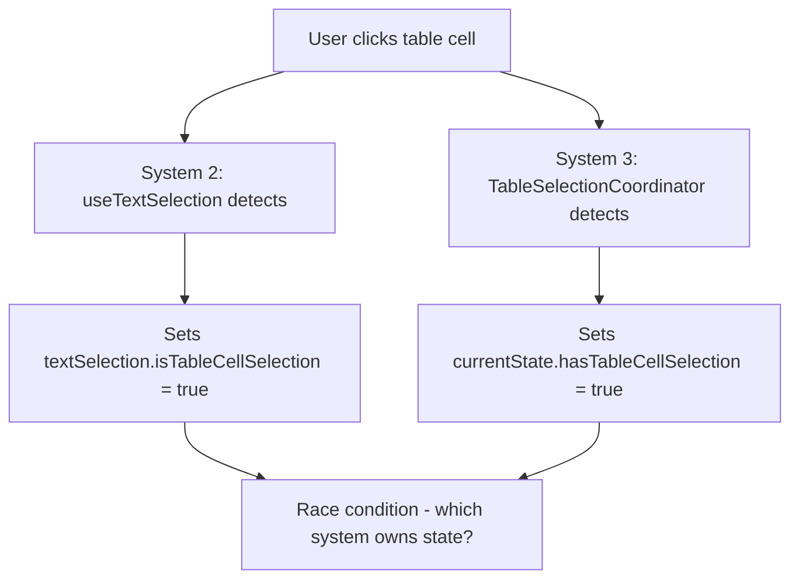

# Selection System Analysis & Root Cause Documentation

## Executive Summary

**Root Cause Identified**: The EVIDENS editor contains **FOUR** isolated, uncoordinated selection systems that compete for control, creating race conditions and preventing consistent typography application across content types.

## Current Selection Systems Architecture

### 🏗️ **System 1: Block Selection (EditorStore)**
- **Location**: `src/store/editorStore.ts`
- **State Variables**: 
  - `selectedNodeId: string | null`
  - `activeBlockId: string | null` (legacy)
  - `selectionState.hasBlockSelection: boolean`
- **Purpose**: Manages which entire block (Rich Block, Table Block) is selected
- **Triggers**: Clicking outside content areas, block boundaries
- **Typography Impact**: Can apply block-level styles but NOT text-level marks

### 🎯 **System 2: Text Selection (useTextSelection)**
- **Location**: `src/hooks/useTextSelection.ts`
- **State Variables**:
  - `textSelection: TextSelectionInfo | null`
  - `hasSelection: boolean`
  - `isTipTapSelection: boolean`
  - `isTableCellSelection: boolean` (cross-system coordination attempt)
- **Purpose**: Detects text selections within TipTap editors
- **Triggers**: Text selection events, 300ms delayed clearing
- **Typography Impact**: Can apply TipTap marks when `isTipTapSelection: true`

### 🏛️ **System 3: Table Selection (TableSelectionCoordinator)**
- **Location**: `src/components/editor/extensions/Table/selection/TableSelectionCoordinator.ts`
- **State Variables**:
  - `currentState.hasTableCellSelection: boolean`
  - `currentState.activeTable: TableInfo`
  - `selectionLock: boolean`
  - `cellInteractionActive: boolean`
- **Purpose**: Manages table-level and cell-level selections
- **Triggers**: Table cell clicks, keyboard navigation, 300ms delayed clearing
- **Typography Impact**: Can apply typography through cell editors

### 🎨 **System 4: Toolbar Typography Router (UnifiedToolbar)**
- **Location**: `src/components/editor/UnifiedToolbar.tsx`
- **State Variables**:
  - `useSelectionTypography: boolean` (computed)
  - `useTableCellTypography: boolean` (computed) 
  - `typographyActive: boolean` (computed)
- **Purpose**: Routes typography commands to appropriate system
- **Triggers**: Toolbar button interactions
- **Typography Impact**: **FRAGMENTED** - different handlers for each selection type

## 🚨 **Critical Conflicts Identified**

### **Conflict 1: Competing State Ownership**


**Impact**: Selection state inconsistency leads to toolbar confusion

### **Conflict 2: Timing Mismatches**
- **useTextSelection**: 300ms delayed clearing via `clearTimeoutRef`
- **TableSelectionCoordinator**: 300ms delayed clearing via `clearSelectionTimeout` 
- **UnifiedToolbar**: Immediate interaction preservation attempts
- **EditorStore**: Immediate block selection changes

**Impact**: Different systems clear selections at different times, causing race conditions

### **Conflict 3: Typography Application Logic Fragmentation**
```typescript
// Example from logs: "Font weight requires text selection"
if (useSelectionTypography) {
  return handleSelectionTypography({ fontWeight });
} else {
  console.warn('Font weight requires text selection - please select text to apply font weight');
}
```

**Impact**: User clicks Bold → System doesn't recognize table cell as valid selection → Warning logged → No formatting applied

### **Conflict 4: Coordination Attempt Failures**
Multiple systems attempt to coordinate but create **circular dependencies**:
- `useTextSelection` checks `TableSelectionCoordinator.hasTableCellSelection()`
- `TableSelectionCoordinator` updates `textSelection` via `setTextSelection()`  
- `UnifiedToolbar` computes state based on both systems
- **Result**: Coordination logic becomes complex and failure-prone

## 📊 **Selection Flow Analysis**

### **Current Problematic Flow (Table Cell Bold)**
```
1. User clicks table cell
   ├── TableSelectionCoordinator.focusCell() → hasTableCellSelection = true
   ├── useTextSelection.detectTableCellSelection() → isTableCellSelection = true  
   └── EditorStore.selectedNodeId remains unchanged
   
2. User clicks Bold button
   ├── UnifiedToolbar computes: useTableCellTypography = true
   ├── handleToolbarMouseDown() → tableSelectionCoordinator.startToolbarInteraction()
   └── handleFontWeight() called
   
3. Font weight handler logic
   ├── Checks: useSelectionTypography = false (table cell excludes this)
   ├── Fallback: Logs "Font weight requires text selection"
   └── NO FORMATTING APPLIED
   
4. User sees failure
   ├── Selection may be cleared by timing conflicts
   └── User reports: "unable to interact with any menu without losing selection"
```

### **Root Cause**: **System Fragmentation**
The fundamental issue is **architectural**: we have 4 systems trying to manage what should be **ONE UNIFIED SELECTION STATE**.

## 💡 **Solution Requirements**

### **Single Source of Truth**
Replace 4 systems with 1 unified selection state machine:
```typescript
interface UnifiedSelectionState {
  type: 'none' | 'block' | 'text' | 'table-cell';
  // ... unified state
}
```

### **Consistent Typography Application**
Single typography handler that works regardless of selection type:
```typescript
const applyTypography = (properties: TypographyProperties) => {
  const { currentSelection } = useUnifiedSelection();
  return currentSelection.applyFormatting(properties);
}
```

### **Atomic State Transitions**
Prevent race conditions with state machine approach:
```typescript
type SelectionAction = 
  | { type: 'SELECT_BLOCK'; blockId: string }
  | { type: 'SELECT_TABLE_CELL'; tableId: string; position: Position }
  | { type: 'PRESERVE_DURING_TOOLBAR_INTERACTION' };
```

## 🎯 **Success Metrics for Unified System**

1. **Eliminate Race Conditions**: No competing selection systems
2. **Consistent Typography**: Bold works in table cells just like normal text
3. **Simplified Logic**: Remove ~70% of selection coordination code
4. **Predictable Behavior**: User actions have consistent results across content types

## 📝 **Migration Strategy**

1. **Phase 1**: Build unified system alongside existing systems
2. **Phase 2**: Migrate UnifiedToolbar to use unified system only
3. **Phase 3**: Replace individual selection systems with unified architecture
4. **Phase 4**: Remove obsolete coordination logic

This analysis reveals that the user's issue isn't a simple bug - it's a fundamental architectural problem requiring systematic redesign of the selection architecture.