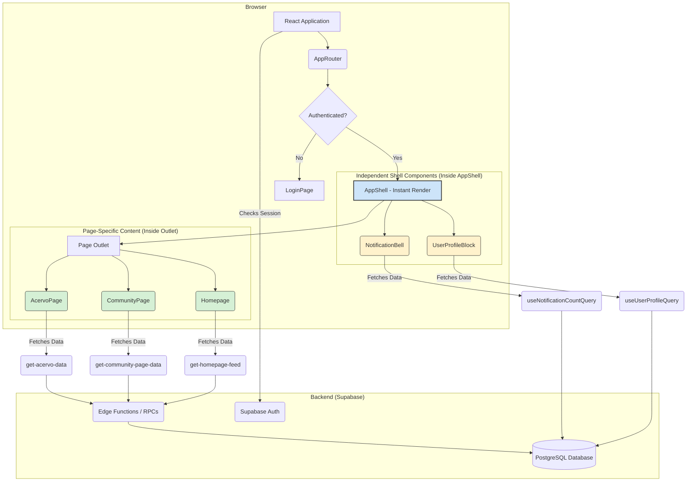

# **[DOC_2] System Architecture**

**Version:** 4.0 (Decoupled Architecture Update)  
**Date:** June 20, 2025  
**Purpose:** This document defines the canonical system architecture for the EVIDENS platform, optimized for the Vite + React development environment with decoupled data layer.

---

## **1.0 Architecture Overview**

### **1.1 Core Technology Stack**

**Frontend Application:**
- **Framework:** Vite + React 18 (Single-Page Application)
- **Language:** TypeScript (Strict Mode)
- **Styling:** TailwindCSS + shadcn/ui components
- **State Management:** TanStack Query v5 + Zustand
- **Routing:** React Router v6
- **Build Tool:** Vite

**Backend Services:**
- **Database:** PostgreSQL (via Supabase)
- **Authentication:** Supabase Auth with JWT custom claims
- **API Layer:** Supabase auto-generated APIs + Edge Functions
- **File Storage:** Supabase Storage
- **Real-time:** Supabase Realtime (WebSocket)

### **1.2 Application Architecture**

The EVIDENS platform is implemented as a unified, client-side rendered (CSR) application with a **decoupled data architecture**. This single application serves:

1. **Public Interface:** Homepage, Acervo (review collection), community features
2. **Authenticated Experience:** User profiles, personalized feeds, contribution features  
3. **Administrative Interface:** Content management and moderation (via protected routes)

### **1.3 Architectural Principles**

**PRINCIPLE 1 (Decoupled Data Layer):** Each component and page is responsible for its own data requirements. No global data providers except for truly global state (authentication).

**PRINCIPLE 2 (Instant Shell Rendering):** The application shell renders immediately without waiting for any data fetching operations.

**PRINCIPLE 3 (Granular Data Fetching):** Data is fetched at the most specific scope possible - individual components fetch only what they need.

---

## **2.0 Decoupled Architecture Model**

### **2.1 System Flow Diagram**



### **2.2 Key Architectural Changes**

**FROM (Legacy Pattern):**
- Global AppDataProvider wrapping entire application
- Single consolidated query fetching all data upfront
- Shell components dependent on global context
- Blocked rendering until data loads

**TO (Current Pattern):**
- Instant shell rendering with independent components
- Granular, scoped data fetching per component/page
- Self-contained shell components with their own queries
- Parallel data loading with skeleton states

---

## **3.0 Frontend Application Structure**

### **3.1 Directory Organization**

The application follows a feature-first organization pattern within the `src/` directory:

```
/src/
├── components/
│   ├── shell/          # App layout (AppShell, Sidebar, Header)
│   ├── homepage/       # Homepage-specific components
│   ├── acervo/         # Acervo-specific components
│   ├── community/      # Community-specific components
│   ├── auth/           # Authentication components
│   └── ui/             # Reusable UI components (buttons, cards, etc.)
├── config/             # Application configuration (navigation, constants)
├── contexts/           # React Context providers (auth only)
├── hooks/              # UI-specific custom hooks
├── pages/              # Top-level route components
├── store/              # Zustand global state stores
├── lib/                # Utility functions and Supabase client
└── types/              # Shared TypeScript interfaces
/packages/hooks/        # Data-fetching hooks (TanStack Query)
```

### **3.2 Component Architecture Principles**

1. **Atomic Design:** UI components are organized from atomic (Button) to complex (ReviewCarousel)
2. **Feature Isolation:** Feature-specific components are co-located with their logic
3. **Shared UI Library:** Common components are centralized in `components/ui/`
4. **Data Independence:** Components fetch their own data via dedicated hooks
5. **Responsive Design:** All components implement mobile-first, adaptive designs

### **3.3 State Management Strategy**

**Local State:** `useState` and `useReducer` for component-specific state
**Server State:** TanStack Query for all API interactions and caching
**Global State:** Zustand ONLY for authentication state and app-wide configuration
**Form State:** React Hook Form for complex form interactions

---

## **4.0 Data Architecture**

### **4.1 Decoupled Data Fetching**

**Shell Components:**
- `UserProfileBlock` → `useUserProfileQuery()`
- `NotificationBell` → `useNotificationCountQuery()`

**Page Components:**
- `Index.tsx` → `useConsolidatedHomepageFeedQuery()` (exception - multiple modules)
- `CommunityPage.tsx` → `useCommunityPageQuery()`
- `CollectionPage.tsx` → `useAcervoDataQuery()`

**Specialized Components:**
- Individual hooks for specific features (e.g., `useSavePostMutation`)

### **4.2 Data Fetching Rules**

1. **No Global Data Providers:** Only authentication state is global
2. **Component-Scoped Queries:** Each component fetches only what it needs
3. **Independent Loading States:** Components manage their own skeleton/error states
4. **Parallel Data Loading:** Multiple queries run concurrently without blocking

---

## **5.0 Backend Architecture**

### **5.1 Supabase Services Integration**

**Database Layer:**
- PostgreSQL with Row Level Security (RLS) policies
- Auto-generated REST APIs with real-time subscriptions
- Custom database functions for complex business logic

**Authentication:**
- JWT-based authentication with custom claims
- Role-based access control (practitioner, moderator, admin)
- OAuth providers (Google) + email/password

**Edge Functions:**
- Server-side business logic for complex operations
- Rate limiting and input validation
- Integration with external services

### **5.2 Data Fetching Architecture**

All data fetching follows the patterns defined in [DOC_6]_DATA_FETCHING_STRATEGY.md:

**Golden Rules:**
1. UI components NEVER call Supabase client directly
2. All data access is encapsulated in custom hooks
3. Mutations invalidate relevant queries for consistency
4. Each hook has a single, clear responsibility

---

## **6.0 Security Architecture**

### **6.1 Authentication & Authorization**

**JWT Custom Claims:** User roles and subscription tiers are embedded in JWT tokens via database triggers
**Row Level Security:** All database access is controlled via RLS policies
**Route Protection:** Sensitive routes use `ProtectedRoute` component with role checking
**API Rate Limiting:** All Edge Functions implement rate limiting

### **6.2 Data Access Patterns**

**Public Data:** Available to anonymous users (published reviews, public profiles)
**User Data:** Accessible only to the authenticated user (personal settings, private data)
**Tier-based Access:** Premium content restricted by subscription tier
**Admin Data:** Administrative functions restricted to admin role

---

## **7.0 Performance & Scalability**

### **7.1 Client-Side Optimizations**

**Code Splitting:** Vite automatically splits code by routes and components
**Query Caching:** TanStack Query provides aggressive caching with 5-minute stale time
**Optimistic Updates:** User interactions update immediately with server synchronization
**Image Optimization:** Responsive images with proper sizing and lazy loading
**Parallel Loading:** Independent data queries prevent waterfall effects

### **7.2 Database Optimizations**

**Indexing:** Critical foreign keys and query patterns are indexed
**Query Optimization:** Database functions minimize round-trips
**Connection Pooling:** Managed by Supabase infrastructure
**Realtime Subscriptions:** Used sparingly for critical real-time features

---

## **8.0 Future Extensibility**

### **8.1 Architectural Benefits**

The decoupled architecture provides:
- **Scalability:** New features don't affect existing components
- **Performance:** Components load independently without blocking
- **Maintainability:** Clear separation of concerns
- **Testability:** Components can be tested in isolation

### **8.2 Migration Considerations**

Should future requirements necessitate:
- **Server-Side Rendering:** The component architecture is compatible with Next.js migration
- **Multi-app Structure:** Components can be extracted to shared packages
- **API Gateway:** Edge Functions can be migrated to dedicated backend services

---

*End of [DOC_2] System Architecture*
