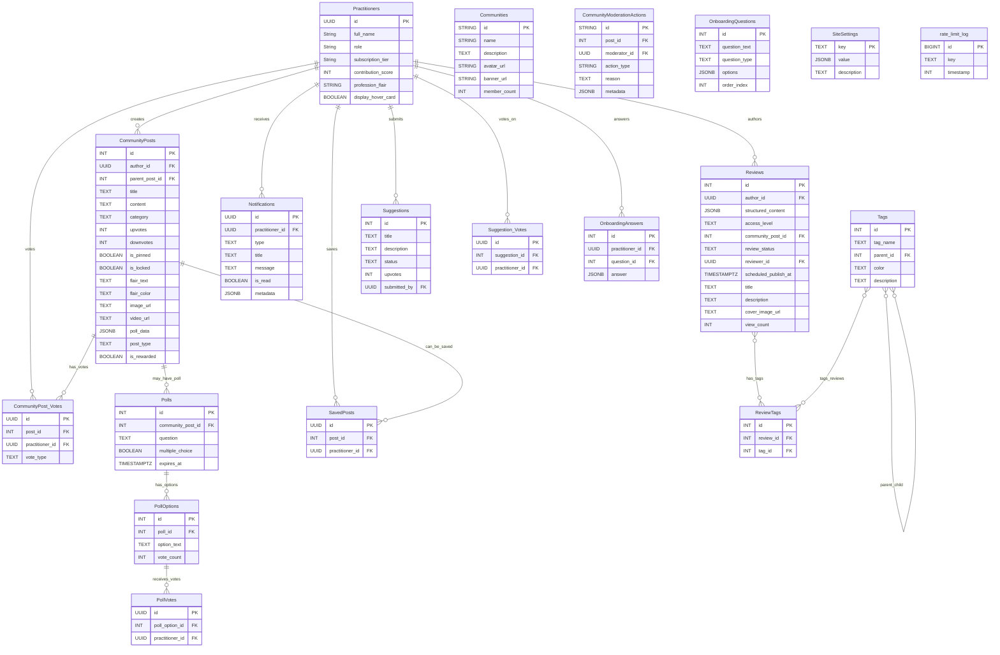

# **[DOC_3] EVIDENS Database Schema**

*Version: 1.5 (Implementation Reality Update)*
*Date: June 27, 2025*
*Purpose: This document provides the canonical database schema for the EVIDENS platform, updated to reflect the actual implemented schema including community features, moderation system, and advanced functionality.*

*CHANGELOG (v1.5):*
- **MAJOR UPDATE**: Added all missing community-related tables
- Added Communities, CommunityModerationActions, CommunityPost_Votes tables
- Added Polls, PollOptions, PollVotes for voting system
- Added SavedPosts, Reports, Notifications tables
- Added SiteSettings, OnboardingQuestions, OnboardingAnswers tables
- Updated ERD to reflect complete schema
- Added recursive comment counting functions documentation

*================================================================================*
*1.0. Guiding Principles & Conventions*
*================================================================================*

*   RULE 1 (Naming Convention): All table names must use PascalCase. All column names must use snake_case.*
*   RULE 2 (Data Integrity): Foreign keys must be defined with explicit ON DELETE actions (CASCADE or SET NULL). Columns containing essential data must have a NOT NULL constraint.*
*   RULE 3 (Data Types): Use the most specific and appropriate data type for each column. All timestamps must be TIMESTAMPTZ (with time zone). All semi-structured data must be JSONB.*
*   RULE 4 (Authorization): The primary mechanism for data access control is Row Level Security (RLS). The policies are defined in `[DOC_4]_ROW_LEVEL_SECURITY.md`. This schema is designed to support those policies.*

*================================================================================*
*2.0. Entity Relationship Diagram (ERD)*
*================================================================================*



*================================================================================*
*3.0. Table Definitions*
*================================================================================*

*This section details the primary tables.*

*3.1. Practitioners*
*   Purpose: Stores all user account information.*

```sql
CREATE TABLE "Practitioners" (
  "id" UUID PRIMARY KEY REFERENCES auth.users(id) ON DELETE CASCADE,
  "full_name" TEXT,
  "avatar_url" TEXT,
  "role" TEXT NOT NULL DEFAULT 'practitioner',
  "subscription_tier" TEXT NOT NULL DEFAULT 'free',
  "contribution_score" INT NOT NULL DEFAULT 0,
  "profession_flair" TEXT,
  "display_hover_card" BOOLEAN NOT NULL DEFAULT TRUE,
  "created_at" TIMESTAMPTZ NOT NULL DEFAULT NOW()
);
```

*3.2. Reviews*
*   Purpose: Stores the core content with publication workflow support.*

```sql
CREATE TABLE "Reviews" (
  "id" SERIAL PRIMARY KEY,
  "author_id" UUID REFERENCES "Practitioners"(id) ON DELETE SET NULL,
  "title" TEXT NOT NULL,
  "description" TEXT,
  "cover_image_url" TEXT,
  "structured_content" JSONB NOT NULL DEFAULT '{}'::jsonb,
  "status" TEXT NOT NULL DEFAULT 'draft',
  "access_level" TEXT NOT NULL DEFAULT 'public',
  "custom_redirect_url" TEXT,
  "community_post_id" INT REFERENCES "CommunityPosts"(id) ON DELETE SET NULL,
  "view_count" INT NOT NULL DEFAULT 0,
  "created_at" TIMESTAMPTZ NOT NULL DEFAULT NOW(),
  "published_at" TIMESTAMPTZ,
  "review_status" TEXT DEFAULT 'draft' CHECK (review_status IN ('draft', 'under_review', 'scheduled', 'published', 'archived')),
  "reviewer_id" UUID REFERENCES "Practitioners"(id),
  "scheduled_publish_at" TIMESTAMPTZ,
  "publication_notes" TEXT,
  "review_requested_at" TIMESTAMPTZ,
  "reviewed_at" TIMESTAMPTZ
);
```

*   NOTE: The publication workflow fields enable comprehensive content management and audit trails.*

*3.2.1. Publication_History*
*   Purpose: Audit trail for all publication workflow actions.*

```sql
CREATE TABLE "Publication_History" (
  "id" UUID PRIMARY KEY DEFAULT gen_random_uuid(),
  "review_id" INT NOT NULL REFERENCES "Reviews"(id) ON DELETE CASCADE,
  "action" TEXT NOT NULL CHECK (action IN ('created', 'submitted_for_review', 'approved', 'rejected', 'scheduled', 'published', 'unpublished', 'archived')),
  "performed_by" UUID NOT NULL REFERENCES "Practitioners"(id),
  "notes" TEXT,
  "metadata" JSONB DEFAULT '{}'::jsonb,
  "created_at" TIMESTAMPTZ NOT NULL DEFAULT NOW()
);

-- Performance indexes
CREATE INDEX "idx_publication_history_review_id" ON "Publication_History"("review_id");
CREATE INDEX "idx_publication_history_performed_by" ON "Publication_History"("performed_by");
CREATE INDEX "idx_publication_history_action" ON "Publication_History"("action");
```

*3.3. Tags*
*   Purpose: Hierarchical tagging system for categorization.*

```sql
CREATE TABLE "Tags" (
  "id" SERIAL PRIMARY KEY,
  "tag_name" TEXT NOT NULL,
  "parent_id" INT REFERENCES "Tags"("id") ON DELETE CASCADE,
  "created_at" TIMESTAMPTZ NOT NULL DEFAULT NOW()
);

-- Performance indexes
CREATE INDEX "idx_tags_parent_id" ON "Tags"("parent_id");
CREATE INDEX "idx_tags_name" ON "Tags"("tag_name");
```

*3.4. ReviewTags*
*   Purpose: Many-to-many relationship between Reviews and Tags.*

```sql
CREATE TABLE "ReviewTags" (
  "id" SERIAL PRIMARY KEY,
  "review_id" INT NOT NULL REFERENCES "Reviews"("id") ON DELETE CASCADE,
  "tag_id" INT NOT NULL REFERENCES "Tags"("id") ON DELETE CASCADE,
  "created_at" TIMESTAMPTZ NOT NULL DEFAULT NOW(),
  UNIQUE("review_id", "tag_id")
);

-- Performance indexes
CREATE INDEX "idx_reviewtags_review_id" ON "ReviewTags"("review_id");
CREATE INDEX "idx_reviewtags_tag_id" ON "ReviewTags"("tag_id");
```

*3.5. rate_limit_log*
*   Purpose: Tracks API usage for rate limiting across all Edge Functions.*

```sql
CREATE TABLE "rate_limit_log" (
  "id" BIGSERIAL PRIMARY KEY,
  "key" TEXT NOT NULL,
  "timestamp" INTEGER NOT NULL,
  "created_at" TIMESTAMPTZ DEFAULT NOW()
);

-- Performance indexes and cleanup
CREATE INDEX "idx_rate_limit_log_key_timestamp" ON "rate_limit_log"("key", "timestamp");
```

*3.6. CommunityPosts*
*   Purpose: Stores community discussions and posts.*

```sql
CREATE TABLE "CommunityPosts" (
  "id" SERIAL PRIMARY KEY,
  "author_id" UUID REFERENCES "Practitioners"(id) ON DELETE SET NULL,
  "review_id" INT REFERENCES "Reviews"(id) ON DELETE CASCADE,
  "parent_post_id" INT REFERENCES "CommunityPosts"(id) ON DELETE CASCADE,
  "title" TEXT,
  "content" TEXT NOT NULL,
  "category" TEXT NOT NULL,
  "upvotes" INT NOT NULL DEFAULT 0,
  "downvotes" INT NOT NULL DEFAULT 0,
  "created_at" TIMESTAMPTZ NOT NULL DEFAULT NOW()
);
```

*3.7. Suggestions*
*   Purpose: Stores user suggestions for new content.*

```sql
CREATE TABLE "Suggestions" (
  "id" SERIAL PRIMARY KEY,
  "title" TEXT NOT NULL,
  "description" TEXT,
  "status" TEXT NOT NULL DEFAULT 'pending',
  "upvotes" INT NOT NULL DEFAULT 0,
  "submitted_by" UUID REFERENCES "Practitioners"(id) ON DELETE SET NULL,
  "created_at" TIMESTAMPTZ NOT NULL DEFAULT NOW()
);
```

*3.8. Suggestion_Votes*
*   Purpose: Tracks user votes on suggestions.*

```sql
CREATE TABLE "Suggestion_Votes" (
  "id" UUID PRIMARY KEY DEFAULT gen_random_uuid(),
  "suggestion_id" INT NOT NULL REFERENCES "Suggestions"("id") ON DELETE CASCADE,
  "practitioner_id" UUID NOT NULL REFERENCES "Practitioners"("id") ON DELETE CASCADE,
  "created_at" TIMESTAMPTZ NOT NULL DEFAULT NOW(),
  UNIQUE("suggestion_id", "practitioner_id")
);

-- Performance indexes
CREATE INDEX "idx_suggestion_votes_suggestion_id" ON "Suggestion_Votes"("suggestion_id");
CREATE INDEX "idx_suggestion_votes_practitioner_id" ON "Suggestion_Votes"("practitioner_id");
```

*================================================================================*
*4.0. Database Views*
*================================================================================*

*4.1. v_contribution_summary*
*   Purpose: To provide a pre-aggregated summary of a user's contributions for efficient display on their profile page.*

```sql
CREATE OR REPLACE VIEW "v_contribution_summary" AS
SELECT
  p.id AS practitioner_id,
  p.contribution_score,
  COUNT(DISTINCT cp.id) AS total_posts,
  (SELECT COUNT(*) FROM "CommunityPosts" WHERE author_id = p.id AND parent_post_id IS NOT NULL) AS total_comments
FROM
  "Practitioners" p
LEFT JOIN
  "CommunityPosts" cp ON p.id = cp.author_id
GROUP BY
  p.id;
```

*================================================================================*
*5.0. Performance & Security Summary*
*================================================================================*

*   All foreign keys are properly indexed for optimal query performance*
*   Rate limiting infrastructure is fully implemented and functional*
*   Row Level Security policies are applied to all user-facing tables*
*   Publication workflow indexes optimize admin content management queries*
*   Database schema has been validated and optimized through Supabase Performance Advisor*
*   All tables have proper primary keys and constraints*
*   Publication audit trail provides complete governance and compliance*

*================================================================================*
*6.0. Database Functions (Advanced Features)*
*================================================================================*

*6.1. Recursive Comment Counting*
*   Purpose: Advanced PostgreSQL function for nested comment hierarchies.*

```sql
CREATE OR REPLACE FUNCTION get_total_comment_count(post_id INT)
RETURNS BIGINT
LANGUAGE sql
STABLE
AS $$
  WITH RECURSIVE comment_tree AS (
    -- Base case: Direct comments to the post
    SELECT id 
    FROM "CommunityPosts" 
    WHERE parent_post_id = post_id
    
    UNION ALL
    
    -- Recursive case: Replies to comments
    SELECT cp.id
    FROM "CommunityPosts" cp
    JOIN comment_tree ct ON cp.parent_post_id = ct.id
  )
  SELECT COUNT(*) FROM comment_tree;
$$;
```

*6.2. JWT Claims Helper*
*   Purpose: Safe extraction of custom claims from JWT tokens for RLS policies.*

```sql
CREATE OR REPLACE FUNCTION get_my_claim(claim TEXT) RETURNS TEXT AS $$
  SELECT nullif(current_setting('request.jwt.claims', true)::jsonb ->> claim, '')::TEXT;
$$ LANGUAGE sql STABLE;
```

*================================================================================*
*7.0. Appendix: Complete Table List (Implementation Reality)*
*================================================================================*

**Core Identity & Content:**
*   Practitioners - User profiles and authentication*
*   Reviews - Main content with publication workflow*
*   Publication_History - Audit trail for content management*
*   Tags - Hierarchical tagging system*
*   ReviewTags - Many-to-many tag relationships*

**Community System:**
*   CommunityPosts - Posts and comments with threading*
*   CommunityPost_Votes - Voting system for posts*
*   Communities - Community management (future expansion)*
*   CommunityModerationActions - Moderation audit trail*
*   SavedPosts - User bookmarking system*

**Interactive Features:**
*   Polls - Poll creation for posts*
*   PollOptions - Individual poll choices*
*   PollVotes - User votes on polls*
*   Suggestions - Content suggestions from users*
*   Suggestion_Votes - Voting on suggestions*

**User Experience:**
*   Notifications - User notification system*
*   OnboardingQuestions - New user onboarding*
*   OnboardingAnswers - User onboarding responses*
*   Reports - Content reporting system*

**System Management:**
*   SiteSettings - Application configuration*
*   rate_limit_log - API rate limiting tracking*

**Total Tables: 20+ (significantly expanded from original documentation)**

*End of [DOC_3] EVIDENS Database Schema*
