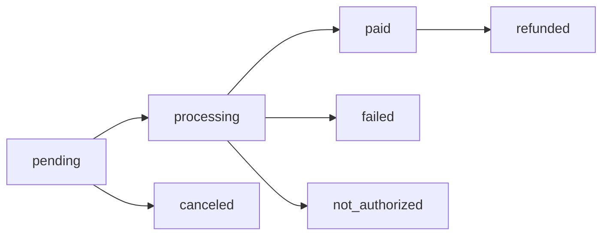

# Pagar.me Charge Management Guide

## Overview

Charges represent individual payment attempts in Pagar.me. Each order can have multiple charges (payment attempts), and each charge contains transaction details, status information, and payment method-specific data.

## Charge Object Structure

### **Core Charge Fields**

```typescript
interface PagarmeCharge {
  id: string;                    // Charge ID
  code: string;                  // Merchant charge reference  
  gateway_id: string;            // Payment gateway ID
  amount: number;                // Charge amount in cents
  status: ChargeStatus;          // Current charge status
  currency: string;              // Always "BRL" for Brazil
  payment_method: PaymentMethod; // Payment method used
  paid_at?: string;              // Payment confirmation timestamp
  canceled_at?: string;          // Cancellation timestamp
  created_at: string;            // Charge creation timestamp
  updated_at: string;            // Last update timestamp
  customer: PagarmeCustomer;     // Customer information
  last_transaction?: PagarmeTransaction; // Latest transaction attempt
  order: PagarmeOrder;           // Parent order
  metadata?: Record<string, any>; // Custom charge data
}

interface PagarmeTransaction {
  id: string;                    // Transaction ID
  transaction_type: TransactionType; // Transaction type
  gateway_id: string;            // Gateway transaction ID
  amount: number;               // Transaction amount
  status: TransactionStatus;     // Transaction status
  auth_code?: string;           // Authorization code (credit card)
  acquirer_name?: string;       // Payment acquirer
  acquirer_tid?: string;        // Acquirer transaction ID
  acquirer_nsu?: string;        // Acquirer NSU
  acquirer_auth_code?: string;  // Acquirer authorization
  
  // PIX specific fields
  qr_code?: string;             // PIX QR code for payment
  qr_code_url?: string;         // PIX copy-paste code
  expires_at?: string;          // PIX expiration timestamp
  
  // Credit card specific fields
  card?: PagarmeCard;           // Card information
  installments?: number;        // Number of installments
  
  created_at: string;           // Transaction timestamp
  updated_at: string;           // Last update timestamp
}

type ChargeStatus = 
  | 'pending'        // Awaiting payment
  | 'processing'     // Payment processing
  | 'paid'           // Payment confirmed  
  | 'failed'         // Payment failed
  | 'canceled'       // Charge canceled
  | 'not_authorized' // Authorization failed
  | 'refunded';      // Charge refunded

type PaymentMethod = 'pix' | 'credit_card' | 'boleto' | 'debit_card';

type TransactionType = 'transaction' | 'partial_capture' | 'capture' | 'void' | 'refund';

type TransactionStatus = 'success' | 'failed' | 'pending';
```

## Charge Status Lifecycle

### **Charge State Machine**



### **Status Transition Rules**
- **pending → processing**: Payment initiation (PIX QR generated, card processing started)
- **processing → paid**: Payment confirmation received
- **processing → failed**: Payment rejected or expired
- **processing → not_authorized**: Authorization denied (insufficient funds, etc.)
- **pending → canceled**: Charge manually canceled before payment
- **paid → refunded**: Refund processed

## Charge Creation

### **Direct Charge Creation**
**Endpoint**: `POST https://api.pagar.me/core/v5/charges`

**Note**: In EVIDENS, charges are typically created indirectly through order creation. Direct charge creation is used for specific scenarios like refunds or standalone payments.

```typescript
// Create standalone charge (advanced usage)
export const createStandaloneCharge = async (chargeData: {
  amount: number;
  customer_id: string;
  payment_method: PaymentMethod;
  payment_config: any;
}) => {
  const headers = authenticatePagarme(Deno.env.get('PAGARME_SECRET_KEY'));
  
  const response = await fetch('https://api.pagar.me/core/v5/charges', {
    method: 'POST',
    headers,
    body: JSON.stringify({
      amount: chargeData.amount,
      customer_id: chargeData.customer_id,
      payment_method: chargeData.payment_method,
      [chargeData.payment_method]: chargeData.payment_config,
      metadata: {
        created_via: 'evidens_direct_charge',
        charge_type: 'standalone'
      }
    })
  });

  if (!response.ok) {
    const error = await response.json();
    throw new Error(`Charge creation failed: ${error.message}`);
  }

  return response.json();
};
```

## Charge Retrieval

### **Get Charge API**

**Endpoint**: `GET https://api.pagar.me/core/v5/charges/{charge_id}`

```typescript
// Fetch charge details
export const getChargeDetails = async (chargeId: string) => {
  const headers = authenticatePagarme(Deno.env.get('PAGARME_SECRET_KEY'));
  
  const response = await fetch(`https://api.pagar.me/core/v5/charges/${chargeId}`, {
    method: 'GET',
    headers
  });

  if (!response.ok) {
    if (response.status === 404) {
      return { charge: null, found: false };
    }
    throw new Error('Failed to fetch charge');
  }

  return { charge: await response.json(), found: true };
};
```

### **List Charges API**

**Endpoint**: `GET https://api.pagar.me/core/v5/charges`

```typescript
// List charges with filtering
export const listCharges = async (filters: {
  page?: number;
  size?: number;
  status?: ChargeStatus;
  customer_id?: string;
  payment_method?: PaymentMethod;
  created_since?: string;
  created_until?: string;
}) => {
  const headers = authenticatePagarme(Deno.env.get('PAGARME_SECRET_KEY'));
  const params = new URLSearchParams();
  
  Object.entries(filters).forEach(([key, value]) => {
    if (value !== undefined) {
      params.append(key, String(value));
    }
  });
  
  const response = await fetch(`https://api.pagar.me/core/v5/charges?${params}`, {
    method: 'GET',
    headers
  });

  if (!response.ok) {
    throw new Error('Failed to list charges');
  }

  return response.json();
};
```

## EVIDENS Charge Integration

### **Charge Status Tracking**

```typescript
// Enhanced charge tracking for EVIDENS (from usePaymentMutations.tsx pattern)
export const useChargeStatus = (chargeId?: string) => {
  return useQuery({
    queryKey: ['charge-status', chargeId],
    queryFn: async () => {
      const response = await fetch(`/functions/v1/get-charge-status?chargeId=${chargeId}`, {
        headers: {
          'Authorization': `Bearer ${import.meta.env.VITE_SUPABASE_ANON_KEY}`
        }
      });
      
      if (!response.ok) {
        throw new Error('Failed to fetch charge status');
      }
      
      const charge = await response.json();
      
      return {
        ...charge,
        // Computed status helpers
        isPending: charge.status === 'pending',
        isProcessing: charge.status === 'processing', 
        isSuccessful: charge.status === 'paid',
        isFailed: ['failed', 'not_authorized'].includes(charge.status),
        isFinal: ['paid', 'failed', 'canceled', 'refunded', 'not_authorized'].includes(charge.status),
        
        // Payment method specific data
        pixData: charge.last_transaction?.qr_code ? {
          qrCode: charge.last_transaction.qr_code,
          qrCodeUrl: charge.last_transaction.qr_code_url,
          expiresAt: charge.last_transaction.expires_at
        } : null,
        
        cardData: charge.payment_method === 'credit_card' ? {
          lastDigits: charge.last_transaction?.card?.last_four_digits,
          brand: charge.last_transaction?.card?.brand,
          authCode: charge.last_transaction?.auth_code,
          installments: charge.last_transaction?.installments
        } : null
      };
    },
    enabled: Boolean(chargeId),
    refetchInterval: (data) => {
      return data?.isFinal ? false : 3000; // Stop polling on final status
    },
    refetchIntervalInBackground: false,
    staleTime: 0
  });
};
```

### **Charge Event Handling**

```typescript
// Handle charge status updates in EVIDENS
export const useChargeEventHandler = () => {
  const queryClient = useQueryClient();
  
  const handleChargeEvent = useCallback(async (charge: PagarmeCharge, event: string) => {
    // Update local payment transaction record
    await supabase
      .from('payment_transactions')
      .update({
        status: mapChargeStatusToLocal(charge.status),
        pagarme_charge_id: charge.id,
        updated_at: new Date().toISOString()
      })
      .eq('pagarme_order_id', charge.order.id);

    // Handle status-specific logic
    switch (charge.status) {
      case 'paid':
        await handleSuccessfulPayment(charge);
        toast.success('Pagamento confirmado!');
        break;
        
      case 'failed':
      case 'not_authorized':
        await handleFailedPayment(charge);
        toast.error('Pagamento não foi processado.');
        break;
        
      case 'canceled':
        await handleCanceledPayment(charge);
        toast.info('Pagamento cancelado.');
        break;
        
      case 'refunded':
        await handleRefundedPayment(charge);
        toast.info('Pagamento reembolsado.');
        break;
    }
    
    // Invalidate related queries
    queryClient.invalidateQueries({ queryKey: ['charge-status', charge.id] });
    queryClient.invalidateQueries({ queryKey: ['order-tracking', charge.order.id] });
    queryClient.invalidateQueries({ queryKey: ['payment-history'] });
    
  }, [queryClient]);
  
  return { handleChargeEvent };
};

const mapChargeStatusToLocal = (pagarmeStatus: ChargeStatus): string => {
  const statusMap = {
    'pending': 'pending',
    'processing': 'processing',
    'paid': 'completed',
    'failed': 'failed',
    'not_authorized': 'failed',
    'canceled': 'canceled',
    'refunded': 'refunded'
  };
  
  return statusMap[pagarmeStatus] || 'unknown';
};
```

## PIX Charge Management

### **PIX Charge Structure**

```typescript
// PIX-specific charge data
interface PixChargeData {
  qrCode: string;           // QR code for mobile scanning
  qrCodeUrl: string;        // Copy-paste PIX code
  expiresAt: string;        // ISO timestamp for expiration
  pixKey?: string;          // PIX key used (optional)
  endToEndId?: string;      // PIX transaction ID (after payment)
}

// Extract PIX data from charge
export const extractPixData = (charge: PagarmeCharge): PixChargeData | null => {
  const transaction = charge.last_transaction;
  
  if (charge.payment_method !== 'pix' || !transaction?.qr_code) {
    return null;
  }
  
  return {
    qrCode: transaction.qr_code,
    qrCodeUrl: transaction.qr_code_url,
    expiresAt: transaction.expires_at || '',
    pixKey: transaction.pix_provider_tid,
    endToEndId: transaction.acquirer_tid
  };
};
```

### **PIX Payment Flow**

```typescript
// Complete PIX payment flow handler
export const usePixPaymentFlow = () => {
  const createPayment = useCreatePixPayment();
  const [currentCharge, setCurrentCharge] = useState<PagarmeCharge | null>(null);
  
  const chargeStatus = useChargeStatus(currentCharge?.id);
  
  const initiatePixPayment = useCallback(async (paymentData: PixPaymentInput) => {
    try {
      const order = await createPayment.mutateAsync(paymentData);
      const charge = order.charges?.[0];
      
      if (!charge) {
        throw new Error('No charge created for order');
      }
      
      setCurrentCharge(charge);
      return { order, charge };
      
    } catch (error) {
      console.error('PIX payment initiation failed:', error);
      throw error;
    }
  }, [createPayment]);
  
  return {
    initiatePixPayment,
    currentCharge,
    chargeStatus: chargeStatus.data,
    isLoading: createPayment.isPending || chargeStatus.isLoading,
    error: createPayment.error || chargeStatus.error,
    pixData: currentCharge ? extractPixData(currentCharge) : null
  };
};
```

## Credit Card Charge Management

### **Credit Card Charge Structure**

```typescript
// Credit card specific charge data
interface CreditCardChargeData {
  authCode: string;             // Authorization code
  acquirerName: string;         // Payment acquirer
  acquirerTid: string;          // Acquirer transaction ID
  acquirerNsu: string;          // Acquirer NSU
  installments: number;         // Number of installments
  cardData: {
    lastDigits: string;         // Last 4 digits
    brand: string;              // Card brand (visa, mastercard, etc.)
    holderName: string;         // Cardholder name
    expirationDate: string;     // MM/YY format
  };
}

// Extract credit card data from charge
export const extractCreditCardData = (charge: PagarmeCharge): CreditCardChargeData | null => {
  const transaction = charge.last_transaction;
  
  if (charge.payment_method !== 'credit_card' || !transaction?.card) {
    return null;
  }
  
  return {
    authCode: transaction.auth_code || '',
    acquirerName: transaction.acquirer_name || '',
    acquirerTid: transaction.acquirer_tid || '',
    acquirerNsu: transaction.acquirer_nsu || '',
    installments: transaction.installments || 1,
    cardData: {
      lastDigits: transaction.card.last_four_digits || '',
      brand: transaction.card.brand || '',
      holderName: transaction.card.holder_name || '',
      expirationDate: `${transaction.card.exp_month}/${transaction.card.exp_year}`
    }
  };
};
```

### **Credit Card Payment Flow**

```typescript
// Credit card payment processing flow
export const useCreditCardPaymentFlow = () => {
  const createPayment = useCreateCreditCardPayment();
  const [currentCharge, setCurrentCharge] = useState<PagarmeCharge | null>(null);
  
  const chargeStatus = useChargeStatus(currentCharge?.id);
  
  const processCardPayment = useCallback(async (paymentData: CreditCardPaymentInput) => {
    try {
      // Card payments are typically processed immediately
      const order = await createPayment.mutateAsync(paymentData);
      const charge = order.charges?.[0];
      
      if (!charge) {
        throw new Error('No charge created for card payment');
      }
      
      setCurrentCharge(charge);
      
      // Check final status immediately for credit cards
      if (charge.status === 'paid') {
        return { 
          order, 
          charge, 
          success: true, 
          requiresConfirmation: false 
        };
      }
      
      return { 
        order, 
        charge, 
        success: false, 
        requiresConfirmation: true 
      };
      
    } catch (error) {
      console.error('Credit card payment failed:', error);
      throw error;
    }
  }, [createPayment]);
  
  return {
    processCardPayment,
    currentCharge,
    chargeStatus: chargeStatus.data,
    isProcessing: createPayment.isPending,
    error: createPayment.error || chargeStatus.error,
    cardData: currentCharge ? extractCreditCardData(currentCharge) : null
  };
};
```

## Charge Status Monitoring

### **Real-time Charge Tracking**

```typescript
// Real-time charge status monitoring
export const useChargeMonitoring = (chargeId?: string) => {
  const [statusHistory, setStatusHistory] = useState<Array<{
    status: ChargeStatus;
    timestamp: string;
    details?: any;
  }>>([]);
  
  const query = useQuery({
    queryKey: ['charge-monitoring', chargeId],
    queryFn: async () => {
      if (!chargeId) return null;
      
      const { charge } = await getChargeDetails(chargeId);
      
      // Track status changes
      setStatusHistory(prev => {
        const lastStatus = prev[prev.length - 1]?.status;
        if (lastStatus !== charge.status) {
          return [...prev, {
            status: charge.status,
            timestamp: new Date().toISOString(),
            details: {
              transactionId: charge.last_transaction?.id,
              gatewayId: charge.last_transaction?.gateway_id
            }
          }];
        }
        return prev;
      });
      
      return charge;
    },
    enabled: Boolean(chargeId),
    refetchInterval: (data) => {
      const finalStates = ['paid', 'failed', 'canceled', 'refunded', 'not_authorized'];
      return data && finalStates.includes(data.status) ? false : 2000;
    },
    refetchIntervalInBackground: false
  });
  
  return {
    ...query,
    statusHistory,
    isMonitoring: query.isLoading || (!query.data?.status || 
      !['paid', 'failed', 'canceled', 'refunded', 'not_authorized'].includes(query.data.status))
  };
};
```

## Charge Error Handling

### **Charge-Specific Error Patterns**

```typescript
// Comprehensive charge error handling
export const handleChargeError = (error: any, paymentMethod: PaymentMethod) => {
  const errorCode = error.code;
  const baseMessage = 'Erro no processamento do pagamento.';
  
  // Payment method agnostic errors
  switch (errorCode) {
    case 'charge_not_found':
      return {
        type: 'not_found',
        message: 'Pagamento não encontrado.',
        action: 'retry_payment'
      };
    
    case 'invalid_amount':
      return {
        type: 'validation',
        message: 'Valor inválido. Mínimo R$ 1,00.',
        action: 'check_amount'
      };
      
    case 'customer_not_found':
      return {
        type: 'customer_error',
        message: 'Cliente não encontrado. Atualize seus dados.',
        action: 'update_customer'
      };
  }
  
  // Payment method specific errors
  if (paymentMethod === 'pix') {
    return handlePixChargeError(errorCode);
  } else if (paymentMethod === 'credit_card') {
    return handleCreditCardChargeError(errorCode);
  }
  
  return {
    type: 'unknown',
    message: baseMessage + ' Tente novamente.',
    action: 'retry_payment'
  };
};

const handlePixChargeError = (errorCode: string) => {
  switch (errorCode) {
    case 'pix_key_invalid':
      return {
        type: 'pix_error',
        message: 'Chave PIX inválida.',
        action: 'contact_support'
      };
      
    case 'pix_expired':
      return {
        type: 'pix_error',
        message: 'PIX expirado. Gere um novo código.',
        action: 'retry_payment'
      };
      
    default:
      return {
        type: 'pix_error',
        message: 'Erro no processamento PIX.',
        action: 'try_different_method'
      };
  }
};

const handleCreditCardChargeError = (errorCode: string) => {
  switch (errorCode) {
    case 'card_declined':
      return {
        type: 'card_error',
        message: 'Cartão recusado pelo banco.',
        action: 'try_different_card'
      };
      
    case 'insufficient_funds':
      return {
        type: 'card_error',
        message: 'Saldo insuficiente.',
        action: 'try_different_card'
      };
      
    case 'card_expired':
      return {
        type: 'card_error',
        message: 'Cartão expirado.',
        action: 'update_card'
      };
      
    case 'invalid_cvv':
      return {
        type: 'card_error',
        message: 'CVV inválido.',
        action: 'check_cvv'
      };
      
    default:
      return {
        type: 'card_error',
        message: 'Erro no processamento do cartão.',
        action: 'try_different_card'
      };
  }
};
```

## Charge Operations

### **Charge Cancellation**

```typescript
// Cancel pending charge
export const cancelCharge = async (chargeId: string, reason?: string) => {
  const headers = authenticatePagarme(Deno.env.get('PAGARME_SECRET_KEY'));
  
  const response = await fetch(`https://api.pagar.me/core/v5/charges/${chargeId}/cancel`, {
    method: 'DELETE',
    headers,
    body: JSON.stringify({
      reason: reason || 'canceled_by_customer'
    })
  });

  if (!response.ok) {
    const error = await response.json();
    throw new Error(`Charge cancellation failed: ${error.message}`);
  }

  return response.json();
};

// Mutation hook for charge cancellation
export const useCancelCharge = () => {
  const queryClient = useQueryClient();
  
  return useMutation({
    mutationFn: ({ chargeId, reason }: { chargeId: string; reason?: string }) => 
      cancelCharge(chargeId, reason),
    onSuccess: (canceledCharge) => {
      // Update local records
      queryClient.invalidateQueries({ queryKey: ['charge-status', canceledCharge.id] });
      queryClient.invalidateQueries({ queryKey: ['order-tracking'] });
      queryClient.invalidateQueries({ queryKey: ['payment-history'] });
      
      toast.info('Pagamento cancelado com sucesso.');
    },
    onError: (error) => {
      console.error('Charge cancellation failed:', error);
      toast.error('Erro ao cancelar pagamento.');
    }
  });
};
```

### **Partial Refunds**

```typescript
// Process partial refund
export const processPartialRefund = async (chargeId: string, refundAmount: number) => {
  const headers = authenticatePagarme(Deno.env.get('PAGARME_SECRET_KEY'));
  
  const response = await fetch(`https://api.pagar.me/core/v5/charges/${chargeId}/partial_refund`, {
    method: 'POST',
    headers,
    body: JSON.stringify({
      amount: refundAmount // Amount in cents
    })
  });

  if (!response.ok) {
    const error = await response.json();
    throw new Error(`Partial refund failed: ${error.message}`);
  }

  return response.json();
};

// Full refund
export const processFullRefund = async (chargeId: string) => {
  const headers = authenticatePagarme(Deno.env.get('PAGARME_SECRET_KEY'));
  
  const response = await fetch(`https://api.pagar.me/core/v5/charges/${chargeId}/refund`, {
    method: 'POST',
    headers
  });

  if (!response.ok) {
    const error = await response.json();
    throw new Error(`Refund failed: ${error.message}`);
  }

  return response.json();
};
```

## Frontend Integration

### **Charge Status Display Component**

```typescript
// Charge status display with real-time updates
export const ChargeStatusDisplay = ({ chargeId }: { chargeId: string }) => {
  const { data: charge, isLoading } = useChargeStatus(chargeId);
  const cancelCharge = useCancelCharge();
  
  if (isLoading) {
    return <div className="flex items-center gap-2">
      <Loader className="h-4 w-4 animate-spin" />
      <span>Carregando status...</span>
    </div>;
  }
  
  if (!charge) {
    return <div className="text-red-600">Pagamento não encontrado</div>;
  }
  
  const getStatusIcon = (status: ChargeStatus) => {
    const iconMap = {
      pending: Clock,
      processing: Loader,
      paid: CheckCircle,
      failed: XCircle,
      canceled: XCircle,
      not_authorized: AlertTriangle,
      refunded: RotateCcw
    };
    return iconMap[status] || HelpCircle;
  };
  
  const StatusIcon = getStatusIcon(charge.status);
  const statusColor = {
    pending: 'text-yellow-600',
    processing: 'text-blue-600',
    paid: 'text-green-600',
    failed: 'text-red-600',
    canceled: 'text-gray-600',
    not_authorized: 'text-red-600',
    refunded: 'text-purple-600'
  }[charge.status] || 'text-gray-600';

  return (
    <div className="flex items-center justify-between p-4 border rounded-lg">
      <div className="flex items-center gap-3">
        <StatusIcon className={`h-5 w-5 ${statusColor}`} />
        <div>
          <p className="font-medium">
            {getChargeStatusDisplayText(charge.status)}
          </p>
          <p className="text-sm text-gray-600">
            R$ {(charge.amount / 100).toFixed(2)} • {charge.payment_method.toUpperCase()}
          </p>
        </div>
      </div>
      
      {charge.status === 'pending' && (
        <Button
          variant="outline"
          size="sm"
          onClick={() => cancelCharge.mutate({ chargeId: charge.id })}
          disabled={cancelCharge.isPending}
        >
          {cancelCharge.isPending ? 'Cancelando...' : 'Cancelar'}
        </Button>
      )}
    </div>
  );
};

const getChargeStatusDisplayText = (status: ChargeStatus): string => {
  const displayMap = {
    pending: 'Aguardando Pagamento',
    processing: 'Processando Pagamento',
    paid: 'Pagamento Confirmado',
    failed: 'Pagamento Falhou',
    canceled: 'Pagamento Cancelado',
    not_authorized: 'Pagamento Não Autorizado',
    refunded: 'Pagamento Reembolsado'
  };
  
  return displayMap[status] || status;
};
```

## Charge Analytics

### **Payment Analytics Hook**

```typescript
// Analytics for payment performance
export const usePaymentAnalytics = (timeframe: 'day' | 'week' | 'month' = 'week') => {
  return useQuery({
    queryKey: ['payment-analytics', timeframe],
    queryFn: async () => {
      const response = await fetch(`/functions/v1/payment-analytics?timeframe=${timeframe}`, {
        headers: {
          'Authorization': `Bearer ${import.meta.env.VITE_SUPABASE_ANON_KEY}`
        }
      });
      
      if (!response.ok) {
        throw new Error('Failed to fetch payment analytics');
      }
      
      const data = await response.json();
      
      return {
        ...data,
        // Computed analytics
        conversionRate: data.totalOrders > 0 ? (data.paidCharges / data.totalCharges) * 100 : 0,
        averageOrderValue: data.paidCharges > 0 ? data.totalRevenue / data.paidCharges : 0,
        pixConversion: data.pixAttempts > 0 ? (data.pixPaid / data.pixAttempts) * 100 : 0,
        cardConversion: data.cardAttempts > 0 ? (data.cardPaid / data.cardAttempts) * 100 : 0
      };
    },
    staleTime: 300000, // Cache for 5 minutes
  });
};
```

## Advanced Charge Features

### **Charge Retry Logic**

```typescript
// Intelligent charge retry for failed payments
export const useChargeRetry = () => {
  return useMutation({
    mutationFn: async ({ originalChargeId, newPaymentMethod }: {
      originalChargeId: string;
      newPaymentMethod: PaymentMethod;
    }) => {
      // Get original charge details
      const { charge: originalCharge } = await getChargeDetails(originalChargeId);
      
      if (!originalCharge || originalCharge.status !== 'failed') {
        throw new Error('Cannot retry non-failed charge');
      }
      
      // Create new charge with same order but different payment method
      const retryPayload = {
        order_id: originalCharge.order.id,
        payment_method: newPaymentMethod,
        amount: originalCharge.amount,
        metadata: {
          ...originalCharge.metadata,
          retry_of: originalChargeId,
          retry_count: (originalCharge.metadata?.retry_count || 0) + 1
        }
      };
      
      const headers = authenticatePagarme(Deno.env.get('PAGARME_SECRET_KEY'));
      const response = await fetch('https://api.pagar.me/core/v5/charges', {
        method: 'POST',
        headers,
        body: JSON.stringify(retryPayload)
      });

      if (!response.ok) {
        const error = await response.json();
        throw new Error(`Charge retry failed: ${error.message}`);
      }

      return response.json();
    },
    onSuccess: (newCharge) => {
      toast.info('Nova tentativa de pagamento iniciada.');
    },
    onError: (error) => {
      console.error('Charge retry failed:', error);
      toast.error('Erro ao tentar novo pagamento.');
    }
  });
};
```

### **Charge Reconciliation**

```typescript
// Reconcile charges with EVIDENS database
export const useChargeReconciliation = () => {
  return useMutation({
    mutationFn: async ({ chargeId, expectedStatus }: {
      chargeId: string;
      expectedStatus?: ChargeStatus;
    }) => {
      // Fetch latest charge status from Pagar.me
      const { charge } = await getChargeDetails(chargeId);
      
      if (!charge) {
        throw new Error('Charge not found in Pagar.me');
      }
      
      // Update local payment transaction record
      const { error } = await supabase
        .from('payment_transactions')
        .update({
          status: mapChargeStatusToLocal(charge.status),
          pagarme_charge_id: charge.id,
          gateway_transaction_id: charge.last_transaction?.gateway_id,
          auth_code: charge.last_transaction?.auth_code,
          acquirer_name: charge.last_transaction?.acquirer_name,
          paid_at: charge.paid_at,
          updated_at: new Date().toISOString()
        })
        .eq('pagarme_charge_id', chargeId);
      
      if (error) {
        throw new Error(`Database reconciliation failed: ${error.message}`);
      }
      
      // Validate status consistency
      if (expectedStatus && charge.status !== expectedStatus) {
        console.warn(`Status mismatch: expected ${expectedStatus}, got ${charge.status}`);
      }
      
      return {
        charge,
        reconciled: true,
        statusChanged: expectedStatus ? charge.status !== expectedStatus : false
      };
    },
    onSuccess: () => {
      queryClient.invalidateQueries({ queryKey: ['payment-history'] });
      queryClient.invalidateQueries({ queryKey: ['user-subscription'] });
    }
  });
};
```

## Testing Strategies

### **Charge Testing Utilities**

```typescript
// Test charge creation and status flow
export const testChargeFlow = async (paymentMethod: PaymentMethod) => {
  console.log(`Testing ${paymentMethod} charge flow...`);
  
  try {
    // Create test order with charge
    const testOrderData = {
      customerId: 'cus_test_customer',
      items: [
        {
          type: 'product' as const,
          description: 'Teste - EVIDENS',
          amount: 1990, // R$ 19.90
          quantity: 1,
          code: 'TEST_ITEM'
        }
      ],
      paymentMethod,
      ...(paymentMethod === 'credit_card' && {
        cardToken: 'card_test_token',
        installments: 1
      })
    };
    
    const order = await createEvidensOrder(testOrderData);
    const charge = order.charges?.[0];
    
    console.log('✓ Order created:', order.id);
    console.log('✓ Charge created:', charge?.id);
    console.log('✓ Initial status:', charge?.status);
    
    if (paymentMethod === 'pix' && charge?.last_transaction?.qr_code) {
      console.log('✓ PIX QR code generated');
    }
    
    // Test status polling
    let attempts = 0;
    const maxAttempts = 10;
    
    while (attempts < maxAttempts) {
      await new Promise(resolve => setTimeout(resolve, 2000)); // Wait 2 seconds
      
      const { charge: updatedCharge } = await getChargeDetails(charge.id);
      console.log(`Status check ${attempts + 1}:`, updatedCharge.status);
      
      if (['paid', 'failed', 'canceled'].includes(updatedCharge.status)) {
        console.log('✓ Final status reached:', updatedCharge.status);
        break;
      }
      
      attempts++;
    }
    
    return {
      success: true,
      orderId: order.id,
      chargeId: charge.id,
      testCompleted: true
    };
    
  } catch (error) {
    console.error('✗ Charge flow test failed:', error);
    return {
      success: false,
      error: error.message,
      testCompleted: false
    };
  }
};
```

## Security Considerations

### **Charge Data Protection**
- **Transaction Data**: Never log complete card numbers or sensitive payment data
- **Auth Codes**: Store securely, never display in UI
- **PIX Codes**: Generate fresh codes, respect expiration times  
- **Refund Data**: Audit all refund operations with user attribution

### **Charge Access Control**

```typescript
// Secure charge access validation
export const validateChargeAccess = async (userId: string, chargeId: string): Promise<boolean> => {
  // Verify charge belongs to user through order relationship
  const { data: paymentTransaction } = await supabase
    .from('payment_transactions')
    .select('user_id, pagarme_charge_id')
    .eq('pagarme_charge_id', chargeId)
    .eq('user_id', userId)
    .single();
  
  return Boolean(paymentTransaction);
};

// Secure charge data retrieval
export const getChargeForUser = async (userId: string, chargeId: string) => {
  const hasAccess = await validateChargeAccess(userId, chargeId);
  
  if (!hasAccess) {
    throw new Error('Unauthorized: Charge does not belong to user');
  }
  
  return getChargeDetails(chargeId);
};
```

## Performance Optimization

### **Charge Data Caching**

```typescript
// Optimized charge caching strategy
export const useOptimizedChargeData = (chargeId?: string) => {
  return useQuery({
    queryKey: ['charge-optimized', chargeId],
    queryFn: () => fetchChargeDetails(chargeId!),
    enabled: Boolean(chargeId),
    staleTime: (data) => {
      // Smart caching based on charge status
      if (!data) return 0;
      
      const finalStates = ['paid', 'failed', 'canceled', 'refunded', 'not_authorized'];
      if (finalStates.includes(data.status)) {
        return 3600000; // 1 hour for final states
      }
      
      if (data.status === 'processing') {
        return 5000; // 5 seconds for processing
      }
      
      return 15000; // 15 seconds for pending
    },
    select: (charge) => ({
      // Core charge data
      id: charge.id,
      status: charge.status,
      amount: charge.amount,
      paymentMethod: charge.payment_method,
      
      // Computed display properties
      displayAmount: OrderAmountCalculator.fromCents(charge.amount),
      statusDisplay: getChargeStatusDisplayText(charge.status),
      isAwaitingPayment: charge.status === 'pending',
      requiresUserAction: ['pending'].includes(charge.status),
      
      // Payment method specific data (conditional)
      ...(charge.payment_method === 'pix' && {
        pixData: extractPixData(charge)
      }),
      ...(charge.payment_method === 'credit_card' && {
        cardData: extractCreditCardData(charge)
      })
    })
  });
};
```

## Integration Checklist

### **Charge Management Setup**
- [ ] Charge status tracking hooks implemented
- [ ] Charge error handling patterns established
- [ ] Charge cancellation functionality working
- [ ] Charge refund processing configured
- [ ] Charge-user access validation implemented

### **Real-time Updates** 
- [ ] Charge status polling optimized
- [ ] Webhook charge event handling configured
- [ ] Charge state synchronization working
- [ ] User notification on status changes functional

### **Payment Method Integration**
- [ ] PIX charge data extraction working
- [ ] Credit card charge processing functional
- [ ] Charge retry logic implemented for failed payments
- [ ] Payment method specific error handling complete

### **UI Components**
- [ ] Charge status display component created
- [ ] Payment confirmation flows implemented
- [ ] Charge analytics dashboard functional
- [ ] User payment history showing charge details

---

**Next Steps**: 
1. [Webhook Integration](./webhooks.md) - Handle real-time payment events
2. [PIX Implementation](../payment-methods/pix.md) - Complete PIX payment flow
3. [Credit Card Processing](../payment-methods/credit-card.md) - Implement card payments