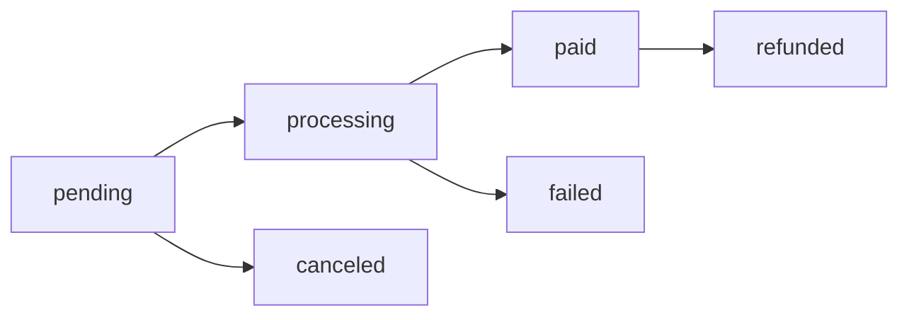

# Pagar.me Order Management Guide

## Overview

Orders are the core transaction entity in Pagar.me, orchestrating customers, items, payments, and shipping. This guide covers order creation, management, and status tracking for EVIDENS payment workflows.

## Order Object Structure

### **Core Order Fields**

```typescript
interface PagarmeOrder {
  id: string;                    // Pagar.me order ID
  code: string;                  // Merchant order reference
  amount: number;                // Total amount in cents (R$ 19.90 = 1990)
  currency: string;              // Always "BRL" for Brazil
  closed: boolean;               // Order completion status
  items: PagarmeOrderItem[];     // Array of order items
  customer: PagarmeCustomer;     // Customer information
  shipping?: PagarmeShipping;    // Shipping details (optional)
  payments?: PagarmePayment[];   // Payment attempts
  status: OrderStatus;           // Current order status
  created_at: string;            // ISO timestamp
  updated_at: string;            // ISO timestamp
  charges: PagarmeCharge[];      // Payment charges
  metadata?: Record<string, any>; // Custom order data
}

interface PagarmeOrderItem {
  id?: string;                   // Item ID (auto-generated)
  type: 'product' | 'shipping' | 'discount'; // Item type
  description: string;           // Item description
  amount: number;               // Item amount in cents
  quantity: number;             // Item quantity
  code?: string;                // SKU or item code
  category?: string;            // Item category
}

type OrderStatus = 
  | 'pending'     // Awaiting payment
  | 'processing'  // Payment processing
  | 'paid'        // Payment confirmed
  | 'canceled'    // Order canceled
  | 'failed'      // Payment failed
  | 'refunded';   // Order refunded
```

## Order Creation

### **Create Order API**

**Endpoint**: `POST https://api.pagar.me/core/v5/orders`

**Required Headers**:
```http
Authorization: Basic <base64(secret_key:)>
Content-Type: application/json
Accept: application/json
```

### **EVIDENS Order Creation Pattern**

```typescript
// Edge Function: create-pix-payment (from usePaymentMutations.tsx)
export default async function handler(req: Request) {
  const { user } = await validateAuth(req);
  const paymentData = await req.json();
  
  // Validate payment data
  const validatedData = pixPaymentSchema.parse(paymentData);
  
  const headers = authenticatePagarme(Deno.env.get('PAGARME_SECRET_KEY'));
  
  // Create order with PIX payment
  const orderPayload = {
    customer_id: validatedData.customerId,
    items: [
      {
        type: 'product',
        description: validatedData.description,
        amount: validatedData.amount,
        quantity: 1,
        code: validatedData.productId || 'EVIDENS_SUBSCRIPTION',
        category: 'digital_service'
      }
    ],
    payments: [
      {
        payment_method: 'pix',
        pix: {
          expires_in: 300, // 5 minutes expiration
          additional_information: [
            {
              name: 'Plataforma',
              value: 'EVIDENS'
            }
          ]
        }
      }
    ],
    metadata: {
      evidens_user_id: user.id,
      creator_id: validatedData.creatorId,
      payment_type: 'subscription',
      created_via: 'evidens_platform'
    }
  };

  const response = await fetch('https://api.pagar.me/core/v5/orders', {
    method: 'POST',
    headers,
    body: JSON.stringify(orderPayload)
  });

  if (!response.ok) {
    const error = await response.json();
    throw new Error(`Order creation failed: ${error.message}`);
  }

  const order = await response.json();
  
  // Store order reference in EVIDENS database
  await supabase
    .from('payment_transactions')
    .insert({
      user_id: user.id,
      pagarme_order_id: order.id,
      amount: validatedData.amount,
      status: 'pending',
      payment_method: 'pix'
    });

  return sendSuccess(order);
}
```

## Order Items Management

### **Item Configuration Patterns**

```typescript
// EVIDENS Subscription Item Structure
export const createSubscriptionItem = (plan: SubscriptionPlan): PagarmeOrderItem => {
  return {
    type: 'product',
    description: `EVIDENS - ${plan.name}`,
    amount: plan.price * 100, // Convert to cents
    quantity: 1,
    code: plan.id,
    category: 'digital_service'
  };
};

// Multiple Items Order Pattern
export const createOrderItems = (items: Array<{
  productId: string;
  name: string;
  price: number; // In reais
  quantity: number;
}>): PagarmeOrderItem[] => {
  return items.map(item => ({
    type: 'product' as const,
    description: item.name,
    amount: Math.round(item.price * 100), // Convert to cents, round to avoid float issues
    quantity: item.quantity,
    code: item.productId,
    category: 'digital_service'
  }));
};

// Discount Item Pattern
export const createDiscountItem = (discountAmount: number, description: string): PagarmeOrderItem => {
  return {
    type: 'discount',
    description: description,
    amount: -Math.abs(discountAmount * 100), // Negative amount for discounts
    quantity: 1,
    code: 'DISCOUNT'
  };
};
```

## Payment Method Configuration

### **PIX Payment Configuration**

```typescript
interface PixPaymentConfig {
  payment_method: 'pix';
  pix: {
    expires_in: number;                    // Expiration in seconds (max: 86400)
    additional_information?: Array<{       // Optional PIX info
      name: string;
      value: string;
    }>;
  };
}

// EVIDENS PIX Payment Pattern
export const createPixPaymentConfig = (expiresIn = 300): PixPaymentConfig => {
  return {
    payment_method: 'pix',
    pix: {
      expires_in: expiresIn,
      additional_information: [
        {
          name: 'Produto',
          value: 'Assinatura EVIDENS'
        },
        {
          name: 'Plataforma',
          value: 'reviews.igoreckert.com.br'
        }
      ]
    }
  };
};
```

### **Credit Card Payment Configuration**

```typescript
interface CreditCardPaymentConfig {
  payment_method: 'credit_card';
  credit_card: {
    installments: number;                  // 1-12 installments
    statement_descriptor?: string;         // Statement description
    card: {
      token: string;                      // Card token from client-side
    };
  };
}

// EVIDENS Credit Card Payment Pattern  
export const createCreditCardPaymentConfig = (
  cardToken: string, 
  installments: number = 1
): CreditCardPaymentConfig => {
  return {
    payment_method: 'credit_card',
    credit_card: {
      installments: Math.min(Math.max(installments, 1), 12), // Clamp between 1-12
      statement_descriptor: 'EVIDENS',
      card: {
        token: cardToken
      }
    }
  };
};
```

## Order Status Management

### **Order Lifecycle**



### **Status Tracking Hook**

```typescript
// Real-time order status tracking
export const useOrderStatus = (orderId?: string) => {
  return useQuery({
    queryKey: ['order-status', orderId],
    queryFn: async () => {
      const response = await fetch(`/functions/v1/get-order-status?orderId=${orderId}`, {
        headers: {
          'Authorization': `Bearer ${import.meta.env.VITE_SUPABASE_ANON_KEY}`
        }
      });
      
      if (!response.ok) {
        throw new Error('Failed to fetch order status');
      }
      
      return response.json();
    },
    enabled: Boolean(orderId),
    refetchInterval: (data) => {
      // Stop polling when order is in final state
      const finalStates = ['paid', 'failed', 'canceled', 'refunded'];
      return finalStates.includes(data?.status) ? false : 5000;
    },
    refetchIntervalInBackground: false,
    staleTime: 0 // Always fetch fresh status
  });
};
```

### **Order Status Transition Handlers**

```typescript
// Handle order status changes
export const useOrderStatusHandler = () => {
  const queryClient = useQueryClient();
  
  const handleStatusChange = useCallback((order: PagarmeOrder, previousStatus?: OrderStatus) => {
    switch (order.status) {
      case 'paid':
        // Activate subscription or grant access
        queryClient.invalidateQueries({ queryKey: ['user-subscription'] });
        queryClient.invalidateQueries({ queryKey: ['payment-history'] });
        toast.success('Pagamento confirmado! Acesso liberado.');
        break;
        
      case 'failed':
        // Handle payment failure
        toast.error('Pagamento não foi processado. Tente outro método.');
        break;
        
      case 'canceled':
        // Handle cancellation
        toast.info('Pagamento cancelado.');
        break;
        
      case 'processing':
        // Show processing state
        toast.info('Processando pagamento...');
        break;
    }
  }, [queryClient]);
  
  return { handleStatusChange };
};
```

## Order Retrieval

### **Get Order API**

**Endpoint**: `GET https://api.pagar.me/core/v5/orders/{order_id}`

```typescript
// Edge Function: get-order-details  
export const getOrderDetails = async (orderId: string) => {
  const headers = authenticatePagarme(Deno.env.get('PAGARME_SECRET_KEY'));
  
  const response = await fetch(`https://api.pagar.me/core/v5/orders/${orderId}`, {
    method: 'GET',
    headers
  });

  if (!response.ok) {
    if (response.status === 404) {
      return { order: null, found: false };
    }
    throw new Error('Failed to fetch order');
  }

  return { order: await response.json(), found: true };
};
```

### **List Orders API**

**Endpoint**: `GET https://api.pagar.me/core/v5/orders`

**Query Parameters**:
- `page`: Page number (default: 1)
- `size`: Items per page (max: 100)
- `status`: Filter by order status
- `customer_id`: Filter by customer
- `created_since`: ISO date filter
- `created_until`: ISO date filter

```typescript
// Order listing with filters
export const listOrders = async (filters: {
  page?: number;
  size?: number;
  status?: OrderStatus;
  customerId?: string;
  createdSince?: string;
  createdUntil?: string;
}) => {
  const headers = authenticatePagarme(Deno.env.get('PAGARME_SECRET_KEY'));
  const params = new URLSearchParams();
  
  Object.entries(filters).forEach(([key, value]) => {
    if (value !== undefined) {
      params.append(key, String(value));
    }
  });
  
  const response = await fetch(`https://api.pagar.me/core/v5/orders?${params}`, {
    method: 'GET',
    headers
  });

  if (!response.ok) {
    throw new Error('Failed to list orders');
  }

  return response.json();
};
```

## EVIDENS Order Integration

### **Order Creation Workflow**

```typescript
// Complete order creation workflow for EVIDENS
export const createEvidensOrder = async (paymentRequest: {
  customerId: string;
  planId: string;
  paymentMethod: 'pix' | 'credit_card';
  cardToken?: string;
  installments?: number;
}) => {
  
  // 1. Get subscription plan details
  const plan = await getSubscriptionPlan(paymentRequest.planId);
  
  // 2. Create order items
  const items = [
    {
      type: 'product' as const,
      description: `EVIDENS - ${plan.name}`,
      amount: plan.price * 100, // Convert to cents
      quantity: 1,
      code: plan.id,
      category: 'digital_service'
    }
  ];

  // 3. Configure payment method
  const paymentConfig = paymentRequest.paymentMethod === 'pix' 
    ? createPixPaymentConfig(300) // 5 minute expiration
    : createCreditCardPaymentConfig(
        paymentRequest.cardToken!, 
        paymentRequest.installments || 1
      );

  // 4. Create order payload
  const orderPayload = {
    customer_id: paymentRequest.customerId,
    items,
    payments: [paymentConfig],
    metadata: {
      evidens_plan_id: plan.id,
      evidens_plan_type: plan.type,
      payment_flow: 'subscription_signup'
    }
  };

  // 5. Submit to Pagar.me
  const headers = authenticatePagarme(Deno.env.get('PAGARME_SECRET_KEY'));
  const response = await fetch('https://api.pagar.me/core/v5/orders', {
    method: 'POST',
    headers,
    body: JSON.stringify(orderPayload)
  });

  if (!response.ok) {
    const error = await response.json();
    throw new Error(`Order creation failed: ${error.message}`);
  }

  return response.json();
};
```

### **Order Validation Schemas**

```typescript
// Order creation validation
export const orderCreationSchema = z.object({
  customerId: z.string().min(1, { message: 'Customer ID é obrigatório' }),
  items: z.array(z.object({
    description: z.string().min(1, { message: 'Descrição do item é obrigatória' }),
    amount: z.number().min(1, { message: 'Valor deve ser maior que R$ 0,01' }),
    quantity: z.number().min(1, { message: 'Quantidade deve ser pelo menos 1' }),
    type: z.enum(['product', 'shipping', 'discount']),
    code: z.string().optional(),
    category: z.string().optional()
  })).min(1, { message: 'Pelo menos um item é obrigatório' }),
  paymentMethod: z.enum(['pix', 'credit_card', 'boleto']),
  cardToken: z.string().optional(), // Required for credit_card
  installments: z.number().min(1).max(12).optional(),
  metadata: z.record(z.string()).optional()
});

export type OrderCreationInput = z.infer<typeof orderCreationSchema>;
```

## Order Status Tracking

### **Order Polling Pattern**

```typescript
// Real-time order tracking (from usePaymentMutations.tsx)
export const useOrderTracking = (orderId?: string) => {
  const [finalStatus, setFinalStatus] = useState<OrderStatus | null>(null);
  
  const query = useQuery({
    queryKey: ['order-tracking', orderId],
    queryFn: async () => {
      const response = await fetch(`/functions/v1/check-payment-status?orderId=${orderId}`, {
        headers: {
          'Authorization': `Bearer ${import.meta.env.VITE_SUPABASE_ANON_KEY}`
        }
      });
      
      if (!response.ok) {
        throw new Error('Failed to check order status');
      }
      
      const order = await response.json();
      
      // Stop polling on final status
      if (['paid', 'failed', 'canceled', 'refunded'].includes(order.status)) {
        setFinalStatus(order.status);
      }
      
      return order;
    },
    enabled: Boolean(orderId) && !finalStatus,
    refetchInterval: finalStatus ? false : 3000, // Poll every 3 seconds
    refetchIntervalInBackground: false,
    staleTime: 0
  });
  
  return {
    ...query,
    isFinalStatus: Boolean(finalStatus),
    finalStatus
  };
};
```

### **Order Event Handling**

```typescript
// Handle order status events from webhooks
export const handleOrderEvent = (event: {
  type: string;
  data: { object: PagarmeOrder };
}) => {
  const order = event.data.object;
  
  switch (event.type) {
    case 'order.paid':
      // Activate user subscription
      return activateSubscription(order);
      
    case 'order.payment_failed':
      // Handle payment failure
      return handlePaymentFailure(order);
      
    case 'order.canceled':
      // Handle order cancellation
      return handleOrderCancellation(order);
      
    default:
      console.log('Unhandled order event:', event.type);
  }
};

const activateSubscription = async (order: PagarmeOrder) => {
  const userId = order.metadata?.evidens_user_id;
  const planId = order.metadata?.evidens_plan_id;
  
  if (!userId || !planId) {
    console.error('Missing user or plan ID in order metadata');
    return;
  }

  // Update user subscription status
  await supabase
    .from('users')
    .update({
      subscription_status: 'active',
      subscription_tier: planId,
      subscription_started_at: new Date().toISOString(),
      pagarme_last_payment_id: order.id
    })
    .eq('id', userId);
};
```

## Order Amount Calculations

### **Amount Handling Best Practices**

```typescript
// Safe amount calculations for orders
export class OrderAmountCalculator {
  
  // Convert from reais to cents (Pagar.me requirement)
  static toCents(amount: number): number {
    return Math.round(amount * 100);
  }
  
  // Convert from cents to reais for display
  static fromCents(amount: number): number {
    return amount / 100;
  }
  
  // Calculate order total with items and discounts
  static calculateTotal(items: PagarmeOrderItem[]): number {
    return items.reduce((total, item) => {
      return total + (item.amount * item.quantity);
    }, 0);
  }
  
  // Apply installment calculation for credit card
  static calculateInstallmentAmount(total: number, installments: number): number {
    return Math.round(total / installments);
  }
  
  // Validate minimum amount (R$ 1.00 minimum for Pagar.me)
  static validateMinimum(amount: number): boolean {
    return amount >= 100; // 100 cents = R$ 1.00
  }
}

// Usage example
const subscriptionAmount = OrderAmountCalculator.toCents(29.90); // R$ 29.90 -> 2990 cents
const isValidAmount = OrderAmountCalculator.validateMinimum(subscriptionAmount); // true
```

## Error Handling

### **Order Creation Errors**

```typescript
export const handleOrderError = (error: any) => {
  const errorCode = error.code;
  
  switch (errorCode) {
    case 'invalid_customer':
      return {
        field: 'customer',
        message: 'Cliente inválido. Verifique os dados do cliente.',
        action: 'update_customer_profile'
      };
    
    case 'invalid_amount':
      return {
        field: 'amount',
        message: 'Valor inválido. Mínimo R$ 1,00.',
        action: 'check_amount_calculation'
      };
    
    case 'invalid_payment_method':
      return {
        field: 'payment',
        message: 'Método de pagamento inválido.',
        action: 'select_different_method'
      };
    
    case 'insufficient_funds':
      return {
        field: 'payment',
        message: 'Saldo insuficiente ou limite de cartão excedido.',
        action: 'try_different_card'
      };
    
    default:
      return {
        field: 'general',
        message: 'Erro ao processar pedido. Tente novamente.',
        action: 'retry_operation'
      };
  }
};
```

## Frontend Integration

### **Order Creation UI Pattern**

```typescript
// Order summary component for payment flow
export const OrderSummary = ({ 
  plan, 
  paymentMethod, 
  installments 
}: {
  plan: SubscriptionPlan;
  paymentMethod: 'pix' | 'credit_card';
  installments?: number;
}) => {
  
  const totalAmount = plan.price;
  const installmentAmount = installments 
    ? OrderAmountCalculator.fromCents(
        OrderAmountCalculator.calculateInstallmentAmount(
          OrderAmountCalculator.toCents(totalAmount), 
          installments
        )
      )
    : totalAmount;

  return (
    <Card className="p-4">
      <h3 className="font-semibold mb-3">Resumo do Pedido</h3>
      
      <div className="space-y-2 mb-4">
        <div className="flex justify-between">
          <span>Plano: {plan.name}</span>
          <span>R$ {totalAmount.toFixed(2)}</span>
        </div>
        
        {installments && installments > 1 && (
          <div className="flex justify-between text-sm text-gray-600">
            <span>{installments}x no cartão</span>
            <span>R$ {installmentAmount.toFixed(2)}/mês</span>
          </div>
        )}
      </div>
      
      <div className="border-t pt-3">
        <div className="flex justify-between font-semibold">
          <span>Total</span>
          <span>R$ {totalAmount.toFixed(2)}</span>
        </div>
        
        {paymentMethod === 'pix' && (
          <p className="text-sm text-green-600 mt-1">
            PIX - Aprovação instantânea
          </p>
        )}
      </div>
    </Card>
  );
};
```

### **Order Confirmation Pattern**

```typescript
// Order confirmation after successful payment
export const OrderConfirmation = ({ order }: { order: PagarmeOrder }) => {
  const paymentMethod = order.payments?.[0]?.payment_method;
  const isPix = paymentMethod === 'pix';
  const qrCode = order.charges?.[0]?.last_transaction?.qr_code;
  const pixCode = order.charges?.[0]?.last_transaction?.qr_code_url;

  return (
    <div className="text-center">
      <CheckCircle className="h-12 w-12 text-green-500 mx-auto mb-4" />
      
      <h2 className="text-xl font-semibold mb-2">
        Pedido Criado com Sucesso!
      </h2>
      
      <p className="text-gray-600 mb-4">
        Pedido #{order.code} criado
      </p>
      
      {isPix && qrCode && (
        <div className="bg-white p-4 rounded-lg border">
          <p className="text-sm text-gray-600 mb-2">
            Escaneie o QR Code ou use o código PIX:
          </p>
          {/* QR Code component would go here */}
          <PixCode code={pixCode} />
        </div>
      )}
      
      <Button 
        onClick={() => window.location.href = '/dashboard'}
        className="mt-4"
      >
        Ir para Dashboard
      </Button>
    </div>
  );
};
```

## Advanced Order Features

### **Order Metadata Management**

```typescript
// EVIDENS-specific order metadata structure
export interface EvidensOrderMetadata {
  evidens_user_id: string;           // EVIDENS user ID
  evidens_plan_id?: string;          // Subscription plan ID
  creator_id?: string;               // Content creator ID (for revenue sharing)
  campaign_source?: string;          // Marketing campaign attribution
  discount_code?: string;            // Applied discount code
  trial_converted?: boolean;         // Whether this was trial conversion
  payment_flow: string;              // 'subscription_signup' | 'plan_upgrade' | 'one_time'
  created_via: 'evidens_platform';   // Always this value
}

// Metadata helper functions
export const createOrderMetadata = (
  userId: string,
  context: {
    planId?: string;
    creatorId?: string;
    campaignSource?: string;
    discountCode?: string;
    isTrialConversion?: boolean;
    paymentFlow: 'subscription_signup' | 'plan_upgrade' | 'one_time';
  }
): EvidensOrderMetadata => {
  return {
    evidens_user_id: userId,
    evidens_plan_id: context.planId,
    creator_id: context.creatorId,
    campaign_source: context.campaignSource,
    discount_code: context.discountCode,
    trial_converted: context.isTrialConversion || false,
    payment_flow: context.paymentFlow,
    created_via: 'evidens_platform'
  };
};
```

### **Order Search and Filtering**

```typescript
// Search orders by EVIDENS user
export const useUserOrders = (userId?: string) => {
  return useInfiniteQuery({
    queryKey: ['user-orders', userId],
    queryFn: async ({ pageParam = 1 }) => {
      const response = await fetch(`/functions/v1/get-user-orders?userId=${userId}&page=${pageParam}`, {
        headers: {
          'Authorization': `Bearer ${import.meta.env.VITE_SUPABASE_ANON_KEY}`
        }
      });
      
      if (!response.ok) {
        throw new Error('Failed to fetch user orders');
      }
      
      return response.json();
    },
    initialPageParam: 1,
    getNextPageParam: (lastPage, allPages) => {
      return lastPage.hasMore ? allPages.length + 1 : undefined;
    },
    enabled: Boolean(userId),
    staleTime: 30000, // Cache for 30 seconds
  });
};
```

## Testing Patterns

### **Order Testing Utilities**

```typescript
// Test order creation in development
export const testOrderCreation = async () => {
  const testOrder = {
    customerId: 'cus_test_customer_id',
    items: [
      {
        type: 'product' as const,
        description: 'EVIDENS - Teste de Pagamento',
        amount: 1990, // R$ 19.90
        quantity: 1,
        code: 'TEST_PLAN',
        category: 'digital_service'
      }
    ],
    paymentMethod: 'pix' as const
  };

  const response = await fetch('/functions/v1/create-pix-payment', {
    method: 'POST',
    headers: {
      'Content-Type': 'application/json',
      'Authorization': `Bearer ${test_session.access_token}`
    },
    body: JSON.stringify(testOrder)
  });

  console.log('Order creation test:', response.status === 200 ? 'PASS' : 'FAIL');
  
  if (response.ok) {
    const order = await response.json();
    console.log('Test order ID:', order.id);
    console.log('PIX code generated:', Boolean(order.charges?.[0]?.last_transaction?.qr_code));
    return order;
  }
  
  return null;
};
```

## Performance Optimization

### **Order Caching Strategy**

```typescript
// Optimized order data management
export const useOptimizedOrderData = (orderId?: string) => {
  return useQuery({
    queryKey: ['order-details', orderId],
    queryFn: () => fetchOrderDetails(orderId!),
    enabled: Boolean(orderId),
    staleTime: (data) => {
      // Different cache times based on order status
      const finalStates = ['paid', 'failed', 'canceled', 'refunded'];
      return finalStates.includes(data?.status) 
        ? 86400000  // 24 hours for final states
        : 30000;    // 30 seconds for pending states
    },
    select: (order) => ({
      ...order,
      // Computed properties for UI
      displayAmount: OrderAmountCalculator.fromCents(order.amount),
      isPendingPayment: order.status === 'pending',
      isSuccessful: order.status === 'paid',
      requiresAction: ['pending', 'processing'].includes(order.status),
      
      // Payment method specific data
      pixCode: order.charges?.[0]?.last_transaction?.qr_code,
      pixExpiration: order.charges?.[0]?.last_transaction?.expires_at,
      
      // Display helpers
      statusDisplay: getOrderStatusDisplay(order.status),
      paymentMethodDisplay: getPaymentMethodDisplay(order.payments?.[0])
    })
  });
};

const getOrderStatusDisplay = (status: OrderStatus): { label: string; color: string; icon: string } => {
  const statusMap = {
    pending: { label: 'Aguardando Pagamento', color: 'yellow', icon: 'clock' },
    processing: { label: 'Processando', color: 'blue', icon: 'loader' },
    paid: { label: 'Pago', color: 'green', icon: 'check' },
    failed: { label: 'Falhou', color: 'red', icon: 'x' },
    canceled: { label: 'Cancelado', color: 'gray', icon: 'x-circle' },
    refunded: { label: 'Reembolsado', color: 'purple', icon: 'rotate-ccw' }
  };
  
  return statusMap[status] || { label: status, color: 'gray', icon: 'help-circle' };
};
```

## Integration Checklist

### **Order Management Setup**
- [ ] Order creation Edge Functions deployed
- [ ] Order validation schemas implemented  
- [ ] Order status polling configured
- [ ] Order-user linking logic working
- [ ] Order amount calculations tested
- [ ] Order metadata structure defined
- [ ] Order error handling implemented
- [ ] Order UI components created

### **Payment Method Integration**
- [ ] PIX order configuration working
- [ ] Credit card order processing functional  
- [ ] Installment calculation accurate
- [ ] Payment method validation complete
- [ ] Order confirmation UI implemented

### **Status Management**
- [ ] Real-time status tracking operational
- [ ] Webhook order event handling configured
- [ ] Order polling optimization implemented
- [ ] Final status caching working
- [ ] User subscription activation functional

## Common Order Patterns

### **Subscription Order Creation**
```typescript
// Standard EVIDENS subscription order
const subscriptionOrder = {
  customer_id: pagarmeCustomerId,
  items: [
    {
      type: 'product',
      description: 'EVIDENS - Assinatura Mensal',
      amount: 2990, // R$ 29.90
      quantity: 1,
      code: 'EVIDENS_MONTHLY',
      category: 'subscription'
    }
  ],
  payments: [createPixPaymentConfig(300)], // 5 minute PIX expiration
  metadata: createOrderMetadata(userId, {
    planId: 'monthly',
    paymentFlow: 'subscription_signup'
  })
};
```

### **Upgrade Order Creation**
```typescript
// Plan upgrade order pattern
const upgradeOrder = {
  customer_id: pagarmeCustomerId,
  items: [
    {
      type: 'product',
      description: 'EVIDENS - Upgrade para Premium',
      amount: 1500, // Difference between plans
      quantity: 1,
      code: 'EVIDENS_UPGRADE_PREMIUM',
      category: 'upgrade'
    }
  ],
  payments: [paymentConfig],
  metadata: createOrderMetadata(userId, {
    planId: 'premium',
    paymentFlow: 'plan_upgrade'
  })
};
```

---

**Next Steps**: 
1. [Payment Processing](./charges.md) - Learn charge creation and processing
2. [Webhook Integration](./webhooks.md) - Handle real-time payment events  
3. [PIX Implementation](../payment-methods/pix.md) - Complete PIX payment flow