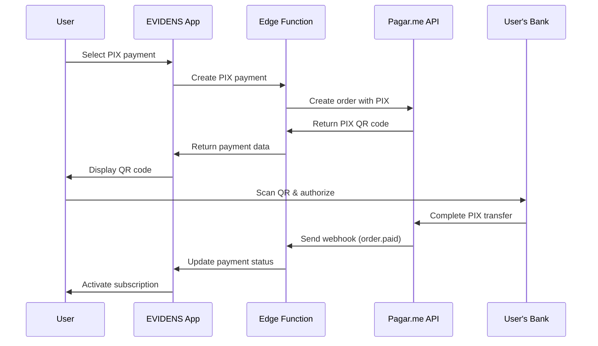

# PIX Payment Implementation Guide

## Overview

PIX is Brazil's instant payment system offering immediate transfers, QR code payments, and zero fees for end customers. This guide provides complete PIX integration for EVIDENS platform.

## PIX Advantages for EVIDENS

### **Business Benefits**
- **📱 Mobile-First**: QR code scanning optimized for mobile users
- **⚡ Instant Settlement**: Immediate payment confirmation and access activation  
- **💸 Zero Customer Fees**: No charges to end users (higher conversion)
- **🏦 Universal Support**: All Brazilian banks and digital wallets
- **🔒 Secure**: Bank-grade security with built-in fraud protection

### **Technical Benefits**
- **Real-time Status**: Instant webhook notifications
- **Simple Integration**: QR code generation and polling
- **No Card Data**: No PCI compliance requirements
- **High Reliability**: 99.9% uptime backed by Brazilian Central Bank

## PIX Payment Flow

### **EVIDENS PIX Workflow**



## PIX Implementation

### **PIX Order Configuration**

```typescript
// PIX payment configuration structure
interface PixPaymentConfig {
  payment_method: 'pix';
  pix: {
    expires_in: number;                    // Expiration in seconds (max: 86400)
    additional_information?: Array<{       // Optional PIX display info
      name: string;                        // Information label
      value: string;                       // Information value
    }>;
  };
}

// EVIDENS PIX configuration factory
export const createPixConfig = (
  expiresIn: number = 300,  // 5 minutes default
  metadata?: { planName?: string; userEmail?: string }
): PixPaymentConfig => {
  const additionalInfo: Array<{name: string; value: string}> = [
    {
      name: 'Produto',
      value: metadata?.planName || 'Assinatura EVIDENS'
    },
    {
      name: 'Plataforma', 
      value: 'reviews.igoreckert.com.br'
    }
  ];
  
  // Add user email for identification (if provided)
  if (metadata?.userEmail) {
    additionalInfo.push({
      name: 'Cliente',
      value: metadata.userEmail
    });
  }
  
  return {
    payment_method: 'pix',
    pix: {
      expires_in: Math.min(expiresIn, 86400), // Max 24 hours
      additional_information: additionalInfo
    }
  };
};
```

### **PIX Payment Creation Edge Function**

```typescript
// Edge Function: create-pix-payment
import "jsr:@supabase/functions-js/edge-runtime.d.ts";
import { authenticatePagarme, validateAuth, sendError, sendSuccess } from '../_shared/helpers.ts';

export default async function handler(req: Request) {
  if (req.method !== 'POST') {
    return sendError('Method not allowed', 405);
  }

  try {
    // 1. Authenticate EVIDENS user
    const { user } = await validateAuth(req);
    
    // 2. Validate payment data
    const paymentData = await req.json();
    const validation = pixPaymentSchema.safeParse(paymentData);
    
    if (!validation.success) {
      return sendError('Invalid payment data', 400, validation.error.errors);
    }
    
    const { customerId, amount, description, productId, metadata } = validation.data;
    
    // 3. Create PIX order in Pagar.me
    const headers = authenticatePagarme(Deno.env.get('PAGARME_SECRET_KEY')!);
    
    const orderPayload = {
      customer_id: customerId,
      items: [
        {
          type: 'product',
          description: description,
          amount: amount, // Already in cents
          quantity: 1,
          code: productId || 'EVIDENS_SUBSCRIPTION',
          category: 'digital_service'
        }
      ],
      payments: [
        createPixConfig(300, { // 5 minute expiration
          planName: description,
          userEmail: user.email
        })
      ],
      metadata: {
        evidens_user_id: user.id,
        evidens_email: user.email,
        payment_flow: 'subscription_signup',
        created_via: 'evidens_platform',
        ...metadata
      }
    };

    const response = await fetch('https://api.pagar.me/core/v5/orders', {
      method: 'POST',
      headers,
      body: JSON.stringify(orderPayload)
    });

    if (!response.ok) {
      const error = await response.json();
      console.error('Pagar.me order creation failed:', error);
      return sendError('Payment creation failed', 400, error);
    }

    const order = await response.json();
    const charge = order.charges?.[0];
    
    if (!charge?.last_transaction?.qr_code) {
      return sendError('PIX QR code generation failed', 500);
    }

    // 4. Store payment transaction in EVIDENS
    await supabase.from('payment_transactions').insert({
      user_id: user.id,
      pagarme_order_id: order.id,
      pagarme_charge_id: charge.id,
      amount: amount,
      payment_method: 'pix',
      status: 'pending',
      expires_at: charge.last_transaction.expires_at,
      created_at: new Date().toISOString()
    });

    // 5. Return payment data for UI
    return sendSuccess({
      orderId: order.id,
      chargeId: charge.id,
      amount: amount,
      status: charge.status,
      pixData: {
        qrCode: charge.last_transaction.qr_code,
        qrCodeUrl: charge.last_transaction.qr_code_url,
        expiresAt: charge.last_transaction.expires_at,
        expiresIn: 300 // seconds
      },
      created: true
    });
    
  } catch (error) {
    console.error('PIX payment creation error:', error);
    return sendError('Internal server error', 500);
  }
}
```

## PIX Frontend Implementation

### **PIX Payment Form Component**

```typescript
// PIX payment form with QR code display
export const PixPaymentForm = ({ 
  planId, 
  customerId, 
  onPaymentCreated 
}: {
  planId: string;
  customerId: string;
  onPaymentCreated: (paymentData: any) => void;
}) => {
  const [pixPayment, setPixPayment] = useState<{
    orderId: string;
    chargeId: string;
    qrCode: string;
    qrCodeUrl: string;
    expiresAt: string;
    expiresIn: number;
  } | null>(null);
  
  const [isExpired, setIsExpired] = useState(false);
  const [timeRemaining, setTimeRemaining] = useState<number>(0);
  
  const createPixPayment = useCreatePixPayment();
  const paymentStatus = usePaymentStatus(pixPayment?.orderId);
  
  // Handle PIX payment creation
  const handleCreatePixPayment = async () => {
    try {
      const result = await createPixPayment.mutateAsync({
        customerId,
        amount: getSubscriptionPlan(planId).price * 100, // Convert to cents
        description: `EVIDENS - ${getSubscriptionPlan(planId).name}`,
        productId: planId
      });
      
      setPixPayment(result.pixData);
      onPaymentCreated(result);
      
    } catch (error) {
      console.error('PIX payment creation failed:', error);
      toast.error('Erro ao gerar PIX. Tente novamente.');
    }
  };
  
  // PIX expiration countdown
  useEffect(() => {
    if (!pixPayment?.expiresAt) return;
    
    const updateTimeRemaining = () => {
      const now = new Date().getTime();
      const expires = new Date(pixPayment.expiresAt).getTime();
      const remaining = Math.max(0, Math.floor((expires - now) / 1000));
      
      setTimeRemaining(remaining);
      setIsExpired(remaining === 0);
    };
    
    updateTimeRemaining();
    const interval = setInterval(updateTimeRemaining, 1000);
    
    return () => clearInterval(interval);
  }, [pixPayment?.expiresAt]);
  
  // Monitor payment status
  useEffect(() => {
    if (paymentStatus.data?.status === 'paid') {
      toast.success('Pagamento PIX confirmado!');
      // Redirect to success page or activate subscription
    }
  }, [paymentStatus.data?.status]);

  // Initial PIX creation UI
  if (!pixPayment) {
    return (
      <Card className="p-6">
        <div className="text-center">
          <div className="w-16 h-16 bg-green-100 rounded-full flex items-center justify-center mx-auto mb-4">
            <QrCode className="w-8 h-8 text-green-600" />
          </div>
          
          <h3 className="text-lg font-semibold mb-2">Pagamento PIX</h3>
          <p className="text-gray-600 mb-6">
            Escaneie o QR code com seu banco ou copie o código PIX
          </p>
          
          <div className="bg-green-50 p-4 rounded-lg mb-4">
            <div className="flex items-center gap-2 text-green-800">
              <CheckCircle className="w-5 h-5" />
              <span className="font-medium">Vantagens do PIX:</span>
            </div>
            <ul className="text-sm text-green-700 mt-2 text-left">
              <li>• Aprovação instantânea</li>
              <li>• Sem taxas para você</li>
              <li>• Disponível 24h/dia</li>
              <li>• Acesso imediato ao conteúdo</li>
            </ul>
          </div>
          
          <Button
            onClick={handleCreatePixPayment}
            disabled={createPixPayment.isPending}
            className="w-full bg-green-600 hover:bg-green-700"
          >
            {createPixPayment.isPending ? 'Gerando PIX...' : 'Gerar Código PIX'}
          </Button>
        </div>
      </Card>
    );
  }
  
  // PIX code display and status monitoring
  return (
    <Card className="p-6">
      <div className="text-center">
        <h3 className="text-lg font-semibold mb-4">Código PIX Gerado</h3>
        
        {/* PIX QR Code */}
        <div className="bg-white p-4 rounded-lg border mb-4">
          <QRCodeDisplay value={pixPayment.qrCode} size={200} />
        </div>
        
        {/* PIX Copy Code */}
        <div className="bg-gray-50 p-3 rounded-lg mb-4">
          <label className="text-sm font-medium text-gray-700 block mb-2">
            Ou copie o código PIX:
          </label>
          <div className="flex items-center gap-2">
            <Input
              value={pixPayment.qrCodeUrl}
              readOnly
              className="text-xs bg-white"
            />
            <Button
              size="sm"
              onClick={() => {
                navigator.clipboard.writeText(pixPayment.qrCodeUrl);
                toast.success('Código copiado!');
              }}
            >
              <Copy className="w-4 h-4" />
            </Button>
          </div>
        </div>
        
        {/* Countdown Timer */}
        {!isExpired ? (
          <div className="flex items-center justify-center gap-2 text-orange-600 mb-4">
            <Clock className="w-4 h-4" />
            <span className="text-sm">
              Expira em {Math.floor(timeRemaining / 60)}:{(timeRemaining % 60).toString().padStart(2, '0')}
            </span>
          </div>
        ) : (
          <div className="text-red-600 mb-4">
            <AlertTriangle className="w-5 h-5 mx-auto mb-1" />
            <p className="text-sm">PIX expirado. Gere um novo código.</p>
          </div>
        )}
        
        {/* Payment Status */}
        <PaymentStatusIndicator status={paymentStatus.data?.status} />
        
        {/* Action Buttons */}
        <div className="flex gap-3 mt-4">
          {isExpired ? (
            <Button
              onClick={() => {
                setPixPayment(null);
                setIsExpired(false);
              }}
              className="flex-1"
            >
              Gerar Novo PIX
            </Button>
          ) : (
            <>
              <Button
                variant="outline"
                onClick={() => setPixPayment(null)}
                className="flex-1"
              >
                Cancelar
              </Button>
              <Button
                onClick={() => window.location.reload()}
                variant="outline"
                className="flex-1"
              >
                Verificar Status
              </Button>
            </>
          )}
        </div>
      </div>
    </Card>
  );
};
```

### **QR Code Display Component**

```typescript
// QR Code display with fallback and styling
import QRCodeLib from 'qrcode';
import { useEffect, useState } from 'react';

export const QRCodeDisplay = ({ 
  value, 
  size = 200,
  includeMargin = true 
}: {
  value: string;
  size?: number;
  includeMargin?: boolean;
}) => {
  const [qrCodeUrl, setQrCodeUrl] = useState<string>('');
  const [error, setError] = useState<string>('');
  
  useEffect(() => {
    const generateQRCode = async () => {
      try {
        const url = await QRCodeLib.toDataURL(value, {
          width: size,
          margin: includeMargin ? 2 : 0,
          color: {
            dark: '#000000',
            light: '#FFFFFF'
          },
          errorCorrectionLevel: 'M'
        });
        
        setQrCodeUrl(url);
        setError('');
      } catch (err) {
        console.error('QR code generation failed:', err);
        setError('Erro ao gerar QR code');
      }
    };
    
    if (value) {
      generateQRCode();
    }
  }, [value, size, includeMargin]);
  
  if (error) {
    return (
      <div className="flex items-center justify-center bg-gray-100 rounded-lg" style={{ width: size, height: size }}>
        <div className="text-center text-gray-500">
          <AlertTriangle className="w-6 h-6 mx-auto mb-2" />
          <p className="text-xs">Erro no QR code</p>
        </div>
      </div>
    );
  }
  
  if (!qrCodeUrl) {
    return (
      <div className="flex items-center justify-center bg-gray-100 rounded-lg" style={{ width: size, height: size }}>
        <Loader className="w-6 h-6 animate-spin text-gray-400" />
      </div>
    );
  }
  
  return (
    
  );
};
```

## PIX Status Management

### **PIX Payment Polling**

```typescript
// Enhanced PIX payment status tracking
export const usePixPaymentTracking = (orderId?: string) => {
  const [paymentConfirmed, setPaymentConfirmed] = useState(false);
  const [failureReason, setFailureReason] = useState<string>('');
  
  const query = useQuery({
    queryKey: ['pix-payment-status', orderId],
    queryFn: async () => {
      const response = await fetch(`/functions/v1/check-payment-status?orderId=${orderId}`, {
        headers: {
          'Authorization': `Bearer ${import.meta.env.VITE_SUPABASE_ANON_KEY}`
        }
      });
      
      if (!response.ok) {
        throw new Error('Failed to check PIX payment status');
      }
      
      const order = await response.json();
      const charge = order.charges?.[0];
      
      // Handle status changes
      if (charge?.status === 'paid' && !paymentConfirmed) {
        setPaymentConfirmed(true);
        
        // Trigger success analytics
        analyticsTrack('payment_confirmed', {
          orderId,
          chargeId: charge.id,
          amount: charge.amount,
          paymentMethod: 'pix',
          timeToPayment: Date.now() - new Date(order.created_at).getTime()
        });
      }
      
      if (charge?.status === 'failed') {
        setFailureReason(charge.last_transaction?.acquirer_message || 'Payment failed');
      }
      
      return {
        order,
        charge,
        status: charge?.status || 'unknown',
        
        // PIX specific data
        pixData: charge?.last_transaction ? {
          qrCode: charge.last_transaction.qr_code,
          qrCodeUrl: charge.last_transaction.qr_code_url,
          expiresAt: charge.last_transaction.expires_at,
          endToEndId: charge.last_transaction.acquirer_tid
        } : null,
        
        // Status helpers
        isPending: charge?.status === 'pending',
        isPaid: charge?.status === 'paid',
        isFailed: charge?.status === 'failed',
        isExpired: charge?.last_transaction?.expires_at && 
                   new Date(charge.last_transaction.expires_at) < new Date(),
        
        // UI helpers
        shouldShowQR: charge?.status === 'pending' && charge?.last_transaction?.qr_code,
        shouldShowSuccess: charge?.status === 'paid',
        shouldShowRetry: charge?.status === 'failed' || 
                        (charge?.last_transaction?.expires_at && 
                         new Date(charge.last_transaction.expires_at) < new Date())
      };
    },
    enabled: Boolean(orderId),
    refetchInterval: (data) => {
      // Stop polling when payment is final or expired
      if (!data) return 3000;
      
      const finalStates = ['paid', 'failed', 'canceled'];
      const isExpired = data.pixData?.expiresAt && new Date(data.pixData.expiresAt) < new Date();
      
      return (finalStates.includes(data.status) || isExpired) ? false : 3000;
    },
    refetchIntervalInBackground: false,
    staleTime: 0
  });
  
  return {
    ...query,
    paymentConfirmed,
    failureReason
  };
};
```

### **PIX Status Display Component**

```typescript
// Real-time PIX payment status indicator
export const PixStatusIndicator = ({ 
  status, 
  isExpired = false,
  timeRemaining = 0 
}: {
  status: ChargeStatus;
  isExpired?: boolean;
  timeRemaining?: number;
}) => {
  
  const getStatusDisplay = () => {
    if (isExpired) {
      return {
        icon: AlertTriangle,
        color: 'text-red-500',
        bgColor: 'bg-red-50',
        borderColor: 'border-red-200',
        title: 'PIX Expirado',
        message: 'Gere um novo código PIX para continuar'
      };
    }
    
    switch (status) {
      case 'pending':
        return {
          icon: QrCode,
          color: 'text-blue-500',
          bgColor: 'bg-blue-50', 
          borderColor: 'border-blue-200',
          title: 'Aguardando Pagamento',
          message: `Escaneie o QR code ou use o código PIX (${Math.floor(timeRemaining / 60)}:${(timeRemaining % 60).toString().padStart(2, '0')})`
        };
        
      case 'processing':
        return {
          icon: Loader,
          color: 'text-orange-500',
          bgColor: 'bg-orange-50',
          borderColor: 'border-orange-200',
          title: 'Processando Pagamento',
          message: 'PIX recebido, confirmando pagamento...'
        };
        
      case 'paid':
        return {
          icon: CheckCircle,
          color: 'text-green-500',
          bgColor: 'bg-green-50',
          borderColor: 'border-green-200',
          title: 'Pagamento Confirmado!',
          message: 'PIX processado com sucesso. Acesso liberado!'
        };
        
      case 'failed':
        return {
          icon: XCircle,
          color: 'text-red-500',
          bgColor: 'bg-red-50',
          borderColor: 'border-red-200',
          title: 'Pagamento Falhou',
          message: 'Houve um problema no processamento. Tente novamente.'
        };
        
      default:
        return {
          icon: HelpCircle,
          color: 'text-gray-500',
          bgColor: 'bg-gray-50',
          borderColor: 'border-gray-200',
          title: 'Status Desconhecido',
          message: 'Verificando status do pagamento...'
        };
    }
  };
  
  const { icon: Icon, color, bgColor, borderColor, title, message } = getStatusDisplay();
  
  return (
    <div className={`p-4 rounded-lg border ${bgColor} ${borderColor}`}>
      <div className="flex items-center gap-3">
        <Icon className={`w-6 h-6 ${color} ${status === 'processing' ? 'animate-spin' : ''}`} />
        <div className="text-left">
          <h4 className={`font-medium ${color}`}>{title}</h4>
          <p className="text-sm text-gray-600">{message}</p>
        </div>
      </div>
    </div>
  );
};
```

## PIX Analytics & Conversion

### **PIX Performance Tracking**

```typescript
// PIX conversion analytics
export const usePixAnalytics = (timeframe: 'day' | 'week' | 'month' = 'week') => {
  return useQuery({
    queryKey: ['pix-analytics', timeframe],
    queryFn: async () => {
      const response = await fetch(`/functions/v1/pix-analytics?timeframe=${timeframe}`, {
        headers: {
          'Authorization': `Bearer ${import.meta.env.VITE_SUPABASE_ANON_KEY}`
        }
      });
      
      if (!response.ok) {
        throw new Error('Failed to fetch PIX analytics');
      }
      
      const data = await response.json();
      
      return {
        ...data,
        // Computed PIX metrics
        pixConversionRate: data.pixAttempts > 0 ? (data.pixPaid / data.pixAttempts) * 100 : 0,
        pixAbandonmentRate: data.pixGenerated > 0 ? (data.pixExpired / data.pixGenerated) * 100 : 0,
        averagePaymentTime: data.pixPaid > 0 ? data.totalPixPaymentTime / data.pixPaid : 0,
        
        // Comparison with other methods
        pixVsCardConversion: data.cardConversion ? data.pixConversionRate / data.cardConversion : 0,
        pixMarketShare: data.totalPayments > 0 ? (data.pixPaid / data.totalPayments) * 100 : 0
      };
    },
    staleTime: 300000, // Cache for 5 minutes
  });
};
```

### **PIX User Experience Optimization**

```typescript
// PIX UX improvement hooks
export const usePixUXOptimization = () => {
  
  // Track PIX abandonment reasons
  const trackPixAbandonment = useCallback(async (reason: 'expired' | 'user_cancel' | 'app_switch') => {
    await fetch('/functions/v1/track-pix-abandonment', {
      method: 'POST',
      headers: { 'Content-Type': 'application/json' },
      body: JSON.stringify({
        reason,
        timestamp: new Date().toISOString(),
        userAgent: navigator.userAgent,
        isMobile: /Mobi|Android/i.test(navigator.userAgent)
      })
    });
  }, []);
  
  // Optimize QR code size based on device
  const getOptimalQRSize = useCallback(() => {
    const screenWidth = window.innerWidth;
    
    if (screenWidth < 400) return 180; // Small mobile
    if (screenWidth < 600) return 220; // Large mobile  
    return 250; // Desktop/tablet
  }, []);
  
  // Detect if user can use PIX (based on user agent)
  const canUsePixNatively = useMemo(() => {
    const userAgent = navigator.userAgent;
    const isBrazilianMobile = /Mobi|Android/i.test(userAgent);
    
    // PIX is most efficient on mobile devices in Brazil
    return isBrazilianMobile;
  }, []);
  
  return {
    trackPixAbandonment,
    getOptimalQRSize,
    canUsePixNatively
  };
};
```

## PIX Business Logic

### **PIX Expiration Handling**

```typescript
// Handle PIX expiration and renewal
export const usePixExpirationHandler = (pixData?: {
  orderId: string;
  chargeId: string;
  expiresAt: string;
}) => {
  const [isExpiring, setIsExpiring] = useState(false);
  const [hasExpired, setHasExpired] = useState(false);
  
  useEffect(() => {
    if (!pixData?.expiresAt) return;
    
    const expiresAt = new Date(pixData.expiresAt).getTime();
    const now = Date.now();
    const timeToExpiration = expiresAt - now;
    
    // Set expiring warning at 1 minute remaining
    if (timeToExpiration <= 60000 && timeToExpiration > 0) {
      setIsExpiring(true);
    }
    
    if (timeToExpiration <= 0) {
      setHasExpired(true);
    }
    
    // Set timeout for expiration
    const timeout = setTimeout(() => {
      setHasExpired(true);
      
      // Track expiration analytics
      analyticsTrack('pix_expired', {
        orderId: pixData.orderId,
        chargeId: pixData.chargeId,
        timeActive: Date.now() - (expiresAt - 300000) // 5 minutes total
      });
      
    }, Math.max(0, timeToExpiration));
    
    return () => clearTimeout(timeout);
  }, [pixData?.expiresAt, pixData?.orderId, pixData?.chargeId]);
  
  return {
    isExpiring,
    hasExpired,
    
    // Renewal function
    renewPix: async () => {
      if (!pixData) return null;
      
      // Cancel existing charge
      await fetch(`/functions/v1/cancel-charge`, {
        method: 'POST',
        headers: { 'Content-Type': 'application/json' },
        body: JSON.stringify({ chargeId: pixData.chargeId })
      });
      
      // Create new PIX with same order data
      return await fetch(`/functions/v1/renew-pix-payment`, {
        method: 'POST',
        headers: { 'Content-Type': 'application/json' },
        body: JSON.stringify({ orderId: pixData.orderId })
      });
    }
  };
};
```

## PIX Testing Strategies

### **PIX Payment Testing**

```typescript
// Comprehensive PIX payment testing
export const testPixPaymentFlow = async () => {
  console.log('Testing complete PIX payment flow...');
  
  try {
    // 1. Create test customer
    const testCustomer = await createPagarmeCustomer({
      name: 'João Silva PIX Test',
      email: `pix.test.${Date.now()}@evidens.com.br`,
      document: '12345678901',
      document_type: 'cpf'
    });
    
    console.log('✓ Test customer created:', testCustomer.id);
    
    // 2. Create PIX payment
    const pixPayment = await createPixPayment({
      customerId: testCustomer.id,
      amount: 1000, // R$ 10.00
      description: 'EVIDENS - Teste PIX',
      productId: 'TEST_PIX'
    });
    
    console.log('✓ PIX payment created:', pixPayment.orderId);
    console.log('✓ QR code generated:', Boolean(pixPayment.pixData?.qrCode));
    console.log('✓ Copy code available:', Boolean(pixPayment.pixData?.qrCodeUrl));
    
    // 3. Test status polling
    let statusChecks = 0;
    const maxChecks = 20;
    
    while (statusChecks < maxChecks) {
      await new Promise(resolve => setTimeout(resolve, 3000)); // Wait 3 seconds
      
      const statusResponse = await fetch(`/functions/v1/check-payment-status?orderId=${pixPayment.orderId}`);
      const orderStatus = await statusResponse.json();
      
      console.log(`Status check ${statusChecks + 1}:`, orderStatus.charges?.[0]?.status);
      
      if (['paid', 'failed', 'expired'].includes(orderStatus.charges?.[0]?.status)) {
        console.log('✓ Final status reached:', orderStatus.charges[0].status);
        break;
      }
      
      statusChecks++;
    }
    
    // 4. Test expiration handling
    const expiresAt = new Date(pixPayment.pixData.expiresAt);
    const timeToExpiration = expiresAt.getTime() - Date.now();
    
    console.log('✓ PIX expires in:', Math.floor(timeToExpiration / 1000), 'seconds');
    
    return {
      success: true,
      testCustomerId: testCustomer.id,
      orderId: pixPayment.orderId,
      chargeId: pixPayment.chargeId,
      qrCodeGenerated: Boolean(pixPayment.pixData?.qrCode),
      expirationConfigured: timeToExpiration > 0
    };
    
  } catch (error) {
    console.error('✗ PIX payment flow test failed:', error);
    return {
      success: false,
      error: error.message
    };
  }
};
```

### **PIX Mock Testing for Development**

```typescript
// Mock PIX responses for development testing
export const mockPixResponses = {
  
  // Mock successful PIX creation
  createSuccess: {
    orderId: 'order_mock_pix_success',
    chargeId: 'charge_mock_pix_success',
    amount: 2990,
    status: 'pending',
    pixData: {
      qrCode: '00020126580014br.gov.bcb.pix0136123e4567-e12b-12d1-a456-426655440000',
      qrCodeUrl: '00020126580014br.gov.bcb.pix0136123e4567-e12b-12d1-a456-426655440000',
      expiresAt: new Date(Date.now() + 300000).toISOString(), // 5 minutes from now
      expiresIn: 300
    }
  },
  
  // Mock payment confirmation
  paymentSuccess: {
    orderId: 'order_mock_pix_success',
    status: 'paid',
    paidAt: new Date().toISOString(),
    endToEndId: 'E12345678202108301230123456789AB'
  },
  
  // Mock expiration
  paymentExpired: {
    orderId: 'order_mock_pix_expired', 
    status: 'failed',
    failureReason: 'pix_expired'
  }
};

// Development mode PIX simulation
export const usePixSimulation = () => {
  const [simulationMode, setSimulationMode] = useState(
    import.meta.env.DEV && localStorage.getItem('pix_simulation') === 'true'
  );
  
  const simulatePixPayment = useCallback(async (action: 'success' | 'expiration' | 'failure') => {
    if (!simulationMode) return;
    
    const delay = action === 'success' ? 10000 : 5000; // 10s for success, 5s for others
    
    setTimeout(() => {
      switch (action) {
        case 'success':
          // Simulate webhook call
          window.dispatchEvent(new CustomEvent('pix-payment-success', {
            detail: mockPixResponses.paymentSuccess
          }));
          break;
          
        case 'expiration':
          window.dispatchEvent(new CustomEvent('pix-payment-expired', {
            detail: mockPixResponses.paymentExpired
          }));
          break;
          
        case 'failure':
          window.dispatchEvent(new CustomEvent('pix-payment-failed', {
            detail: { ...mockPixResponses.paymentExpired, failureReason: 'processing_error' }
          }));
          break;
      }
    }, delay);
  }, [simulationMode]);
  
  return {
    simulationMode,
    setSimulationMode,
    simulatePixPayment,
    mockData: mockPixResponses
  };
};
```

## PIX Security & Compliance

### **PIX Security Best Practices**

```typescript
// PIX security validation
export const pixSecurityValidation = {
  
  // Validate QR code format
  validateQRCode: (qrCode: string): boolean => {
    // Brazilian PIX QR code format validation
    const pixPattern = /^[0-9]{4}[0-9a-z]{8,512}$/i;
    return pixPattern.test(qrCode);
  },
  
  // Validate PIX key format
  validatePixKey: (pixKey: string): { valid: boolean; type: 'cpf' | 'cnpj' | 'email' | 'phone' | 'random' } => {
    // CPF format
    if (/^\d{11}$/.test(pixKey)) {
      return { valid: validateCPF(pixKey), type: 'cpf' };
    }
    
    // CNPJ format  
    if (/^\d{14}$/.test(pixKey)) {
      return { valid: validateCNPJ(pixKey), type: 'cnpj' };
    }
    
    // Email format
    if (/^[^\s@]+@[^\s@]+\.[^\s@]+$/.test(pixKey)) {
      return { valid: true, type: 'email' };
    }
    
    // Phone format
    if (/^\+55\d{10,11}$/.test(pixKey)) {
      return { valid: true, type: 'phone' };
    }
    
    // Random key format (UUID)
    if (/^[0-9a-f]{8}-[0-9a-f]{4}-[0-9a-f]{4}-[0-9a-f]{4}-[0-9a-f]{12}$/i.test(pixKey)) {
      return { valid: true, type: 'random' };
    }
    
    return { valid: false, type: 'cpf' }; // Default fallback
  },
  
  // Validate PIX amount limits
  validateAmount: (amount: number): { valid: boolean; reason?: string } => {
    const amountInReais = amount / 100;
    
    // Minimum amount: R$ 1.00
    if (amountInReais < 1) {
      return { valid: false, reason: 'amount_too_low' };
    }
    
    // Maximum PIX transaction: R$ 20,000.00 (may vary by bank)
    if (amountInReais > 20000) {
      return { valid: false, reason: 'amount_too_high' };
    }
    
    return { valid: true };
  }
};
```

### **PIX Fraud Prevention**

```typescript
// PIX fraud detection patterns
export const pixFraudDetection = {
  
  // Detect suspicious PIX patterns
  detectSuspiciousActivity: async (userId: string, amount: number) => {
    // Check recent PIX attempts
    const { data: recentPayments } = await supabase
      .from('payment_transactions')
      .select('amount, created_at, payment_method')
      .eq('user_id', userId)
      .eq('payment_method', 'pix')
      .gte('created_at', new Date(Date.now() - 3600000).toISOString()) // Last hour
      .order('created_at', { ascending: false });
    
    if (!recentPayments?.length) return { suspicious: false };
    
    // Flag patterns
    const flags: string[] = [];
    
    // Multiple PIX attempts in short time
    if (recentPayments.length > 5) {
      flags.push('rapid_attempts');
    }
    
    // Large amount variation
    const amounts = recentPayments.map(p => p.amount);
    const maxAmount = Math.max(...amounts);
    const minAmount = Math.min(...amounts);
    
    if (maxAmount > minAmount * 10) {
      flags.push('amount_variation');
    }
    
    // Very high amount for new user
    if (amount > 50000 && recentPayments.length === 1) { // R$ 500+
      flags.push('high_amount_new_user');
    }
    
    return {
      suspicious: flags.length > 0,
      flags,
      riskLevel: flags.length > 2 ? 'high' : flags.length > 0 ? 'medium' : 'low'
    };
  }
};
```

## PIX Integration Checklist

### **PIX Technical Setup**
- [ ] PIX payment Edge Function deployed (`create-pix-payment`)
- [ ] PIX QR code generation working
- [ ] PIX copy-paste code functionality implemented
- [ ] PIX expiration countdown working
- [ ] PIX status polling configured (3-second intervals)

### **PIX User Experience**
- [ ] Mobile-optimized QR code scanning
- [ ] Copy-to-clipboard functionality working
- [ ] PIX expiration warnings implemented
- [ ] PIX payment confirmation UI complete
- [ ] PIX retry flow for expired payments functional

### **PIX Business Features**
- [ ] PIX payment analytics tracking
- [ ] PIX conversion rate monitoring
- [ ] PIX abandonment tracking implemented
- [ ] PIX fraud detection patterns configured
- [ ] PIX payment method recommendation logic

### **PIX Testing & Quality**
- [ ] PIX payment flow end-to-end tests passing
- [ ] PIX QR code generation tests working
- [ ] PIX webhook processing tests functional
- [ ] PIX expiration handling tests complete
- [ ] PIX error scenarios covered in tests

## PIX Performance Metrics

### **Key PIX Metrics to Track**

```typescript
// PIX performance indicators
export const PIX_KPI_DEFINITIONS = {
  // Conversion metrics
  pixConversionRate: 'Percentage of PIX attempts that result in successful payment',
  qrCodeScanRate: 'Percentage of users who scan QR vs copy-paste',
  averagePaymentTime: 'Average time from QR generation to payment confirmation',
  
  // User experience metrics
  pixAbandonmentRate: 'Percentage of PIX codes that expire without payment',
  mobileVsDesktopUsage: 'PIX usage distribution by device type',
  retryRate: 'Percentage of users who retry after PIX expiration',
  
  // Business metrics
  pixMarketShare: 'PIX share of total payment volume',
  pixRevenueImpact: 'Revenue contribution from PIX payments',
  customerAcquisitionCost: 'Cost per PIX customer acquisition'
};

// PIX performance dashboard data
export const usePixDashboard = () => {
  return useQuery({
    queryKey: ['pix-dashboard'],
    queryFn: async () => {
      // Fetch comprehensive PIX metrics
      const [analytics, userMetrics, technicalMetrics] = await Promise.all([
        fetch('/functions/v1/pix-analytics?period=30d').then(r => r.json()),
        fetch('/functions/v1/pix-user-metrics?period=30d').then(r => r.json()),
        fetch('/functions/v1/pix-technical-metrics?period=7d').then(r => r.json())
      ]);
      
      return {
        // Business KPIs
        conversionRate: analytics.pixConversionRate,
        totalRevenue: analytics.pixRevenue,
        marketShare: analytics.pixMarketShare,
        
        // User experience
        averagePaymentTime: userMetrics.averagePaymentTime,
        mobileUsageRate: userMetrics.mobileUsageRate,
        qrScanVsCopyRate: userMetrics.qrScanVsCopyRate,
        
        // Technical performance
        qrGenerationSpeed: technicalMetrics.averageQrGenerationTime,
        webhookProcessingSpeed: technicalMetrics.averageWebhookProcessingTime,
        systemUptime: technicalMetrics.pixSystemUptime,
        
        // Recommendations
        optimizations: generatePixOptimizations(analytics, userMetrics, technicalMetrics)
      };
    },
    refetchInterval: 300000, // Refresh every 5 minutes
  });
};

const generatePixOptimizations = (analytics: any, userMetrics: any, technicalMetrics: any) => {
  const recommendations = [];
  
  if (analytics.pixConversionRate < 85) {
    recommendations.push({
      type: 'conversion',
      priority: 'high',
      issue: 'Low PIX conversion rate',
      solution: 'Optimize QR code size and add payment instructions'
    });
  }
  
  if (userMetrics.averagePaymentTime > 180) { // 3 minutes
    recommendations.push({
      type: 'ux',
      priority: 'medium', 
      issue: 'Slow payment completion',
      solution: 'Add payment guidance and mobile app suggestions'
    });
  }
  
  if (technicalMetrics.qrGenerationSpeed > 2000) { // 2 seconds
    recommendations.push({
      type: 'performance',
      priority: 'low',
      issue: 'Slow QR generation',
      solution: 'Optimize Edge Function performance'
    });
  }
  
  return recommendations;
};
```

---

**PIX Summary**: PIX is EVIDENS' primary payment method, offering instant settlement, zero customer fees, and optimal mobile experience. Implementation focuses on QR code generation, real-time status tracking, and seamless user experience with proper expiration handling and retry flows.

**Next Steps**: 
1. [Credit Card Implementation](./credit-card.md) - Card tokenization and processing
2. [Payment Method Comparison](./comparison-guide.md) - Choose optimal payment methods
3. [Edge Function Templates](../edge-functions/pix-payment.md) - Complete PIX Edge Function code