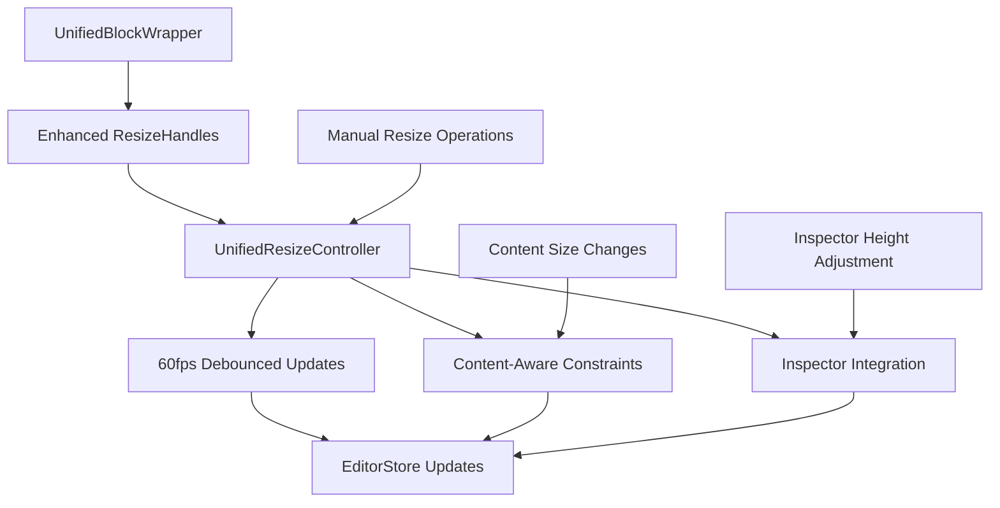

# Unified Resize System Architecture

## 🎯 DESIGN OBJECTIVES

**Primary Goal**: Eliminate dual resize system conflicts while maintaining 60fps performance and integrating height adjustment functionality.

**EVIDENS Compliance**: 
- **[C0.2.4]** Eliminate duplication in components and state management
- **[C0.2.3]** Verify through reactive data patterns (no manual sync)
- **[C0.2.2]** Extend existing patterns before creating new ones

## 🏗️ UNIFIED ARCHITECTURE

### Core Design Principle
**Single Source of Truth**: One unified resize system that handles all resize operations, integrated with the existing UnifiedBlockWrapper.



## 📋 SYSTEM COMPONENTS

### 1. **UnifiedResizeController** (NEW)
**Purpose**: Central coordinator for all resize operations
**Location**: `/src/components/editor/unified-resize/UnifiedResizeController.ts`

```typescript
interface UnifiedResizeController {
  // Core resize operations
  startResize(handle: ResizeHandle, startPosition: MousePosition): void
  updateResize(currentPosition: MousePosition): void
  endResize(): void
  
  // Inspector integration
  adjustHeightToContent(): number
  setDimensions(width: number, height: number): void
  
  // Performance optimization
  enableHighPerformanceMode(): void
  getResizeMetrics(): PerformanceMetrics
}
```

### 2. **Enhanced UnifiedBlockWrapper** (EXTEND)
**Current**: `/src/components/editor/shared/UnifiedBlockWrapper.tsx`
**Changes**: Remove embedded ResizeHandles, delegate to UnifiedResizeController

### 3. **Deprecated: useResizeSystem Hook** (DEPRECATE)
**Current**: `/src/components/editor/ResizeSystem.tsx`
**Status**: Mark for deprecation, migrate DraggableBlock away from this

### 4. **Deprecated: DraggableBlock Resize Logic** (MIGRATE)
**Current**: `/src/components/editor/DraggableBlock.tsx`
**Changes**: Remove useResizeSystem usage, delegate to UnifiedBlockWrapper

## ⚡ PERFORMANCE ARCHITECTURE

### 60fps Optimization Strategy

1. **Single 16ms Debouncer**
   ```typescript
   // Replace dual 16ms debouncers with single optimized version
   const optimizedDebounce = debounce((updates: ResizeUpdate[]) => {
     // Batch all resize updates in single frame
     batchUpdateNodes(updates);
   }, 16);
   ```

2. **Batch Update System**
   ```typescript
   interface BatchedUpdate {
     nodeId: string;
     position: Partial<BlockPosition>;
     source: 'resize' | 'inspector' | 'content';
     priority: 'high' | 'normal';
   }
   ```

3. **Optimized DOM Queries**
   ```typescript
   // Cache DOM references to avoid repeated queries
   const domCache = new Map<string, HTMLElement>();
   ```

## 🎛️ INSPECTOR INTEGRATION

### Height Adjustment Solution

1. **Unified Update Path**
   ```typescript
   // Inspector height adjustments go through UnifiedResizeController
   const inspector = {
     adjustHeight: () => controller.adjustHeightToContent(),
     setDimensions: (w, h) => controller.setDimensions(w, h)
   };
   ```

2. **Conflict Prevention**
   ```typescript
   // Prevent Inspector/Resize conflicts with operation locking
   class OperationLock {
     private currentOperation: 'resize' | 'inspector-adjust' | null = null;
     
     acquireLock(operation: string): boolean {
       if (this.currentOperation === null) {
         this.currentOperation = operation;
         return true;
       }
       return false;
     }
   }
   ```

## 🔧 MIGRATION STRATEGY

### Phase 1: Core System Creation
1. Create `UnifiedResizeController`
2. Create optimized performance layer
3. Add comprehensive tests

### Phase 2: Integration
1. Update `UnifiedBlockWrapper` to use controller
2. Add Inspector integration
3. Maintain backward compatibility

### Phase 3: Migration
1. Update `RichBlockNode` (already uses UnifiedBlockWrapper ✅)
2. Migrate `DraggableBlock` away from `useResizeSystem`
3. Deprecate old resize system

### Phase 4: Cleanup
1. Remove `useResizeSystem` hook
2. Remove duplicate resize logic from `DraggableBlock`
3. Update tests and documentation

## 🧪 TESTING STRATEGY

### 1. **Performance Tests**
```typescript
describe('UnifiedResizeController Performance', () => {
  it('maintains 60fps during continuous resize operations', () => {
    // Measure frame times during resize
    expect(averageFrameTime).toBeLessThan(16.67);
  });
});
```

### 2. **Integration Tests**
```typescript
describe('Inspector Integration', () => {
  it('height adjustment works without conflicts', () => {
    // Verify Inspector updates don't conflict with resize
  });
});
```

### 3. **Migration Tests**
```typescript
describe('System Migration', () => {
  it('maintains existing functionality during migration', () => {
    // Ensure no regression in existing behavior
  });
});
```

## 📏 SUCCESS METRICS

### Performance Targets
- **60fps sustained** during resize operations (≤16.67ms per frame)
- **Single debouncer** replaces dual 16ms systems
- **50% reduction** in DOM queries during resize

### Functionality Targets
- **Inspector height adjustment** works reliably
- **Button persistence** - no disappearing buttons
- **Smooth resize** without blocking/snapping issues

### Code Quality Targets
- **Significant code reduction** vs current dual system
- **Zero new files** for basic functionality (extend existing)
- **Single resize system** - no duplication

## 🎯 IMPLEMENTATION PRIORITY

1. **M2.1**: Core UnifiedResizeController (HIGH)
2. **M2.2**: Integration layer with existing components (HIGH) 
3. **M3.1**: 60fps performance implementation (MEDIUM)
4. **M4.1**: Inspector height adjustment integration (MEDIUM)
5. **M5.1-M5.2**: Testing and migration (MEDIUM)
6. **M6.1**: Legacy cleanup (LOW)

---

**Architecture Status**: ✅ COMPLETE - Ready for implementation
**Next Step**: M2.1 - Core Unified Resize System Implementation